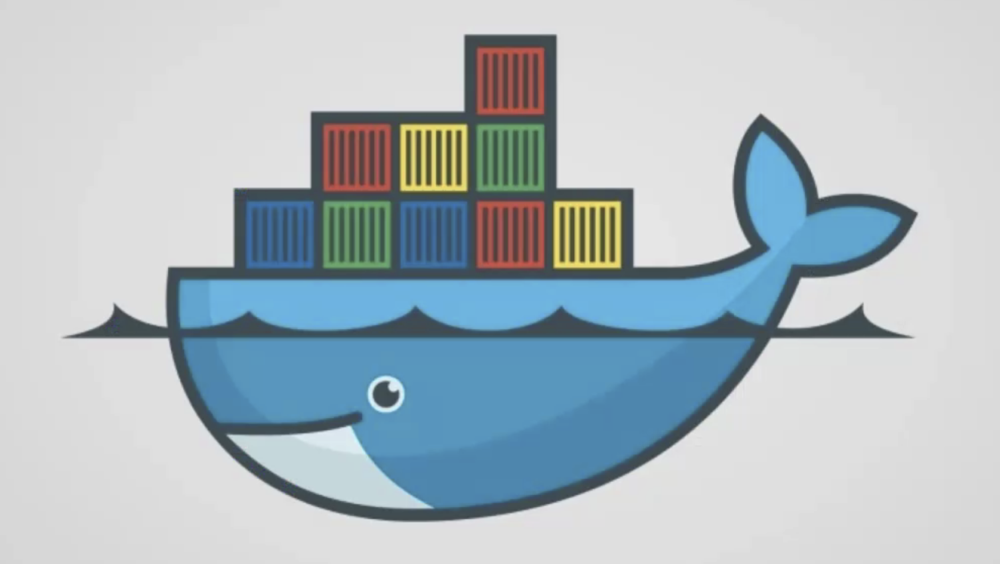
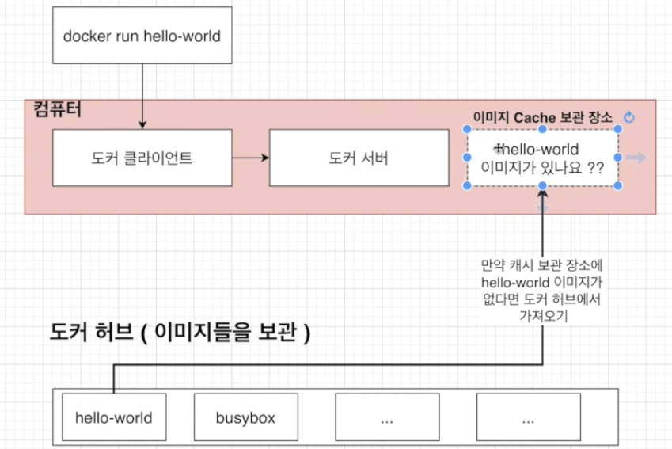
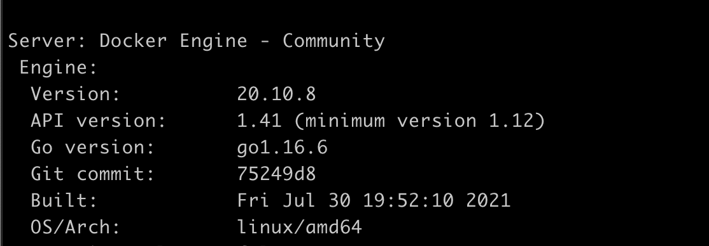

# 도커를 쓰는 이유

도커를 알지 못하던 시절, 프로그램을 다운 받고자 할 때

갖고 있는 서버, 패키지 버전, OS 에 따라
많은 에러를 겪을 수도, 또한 설치 과정이 복잡하다!

# 도커란 무엇인가?

컨테이너를 사용하여, 응용프로그램을 더 쉽게 만들고 배포하고 실행할 수 있도록 설계된 도구

컨테이너 기반의 오픈소스 가상화 플랫폼!

### 서버에서 컨테이너?

프로그램, 실행환경을 컨테이너로 추상화!

프로그램을 손쉽게 이동, 배포, 관리를 할 수 있게 해준다!

# 도커 이미지와 컨테이너 정의

컨테이너 : 코드와 모든 종속성을 패키지화, 컴퓨팅 환경에서 다른 컴퓨팅 환경으로 빠르고 안정적으로 실행되도록 하는 SW의 표준 단위

> 간단하고 편리하게 프로그램을 실행시켜주는 것!

컨테이너 이미지 : 코드, 런타임, 시스템 도구, 시스템 라이브러리 및 설정과 같은 **응용 프로그램을 실행하는 데 필요한 모든 것을 포함**하는 가볍고 독립적이며 실행가능한 **SW 패키지**

런타임에 컨테이너가 되고, 컨테이너는 도커 엔진에서 실행될 때 이미지에서 컨테이너가 된다!

컨테이너는 SW를 환경으로부터 격리시키고, 개발과 스테이징 차이에도 불구하고 균일하게 작동하도록 보장한다!

### 도커 컨테이너?

- 코드가 빌드된 바이너리 파일
- 문제가 있는 컨테이너만 rollback 가능

# 도커 사용할 때 흐름!

도커 Client 와 도커 Server(Daemon)

# 도커와 기존의 가상화 기술 차이를 통한 컨테이너 이해

## 가상화 기술 이전

하나의 서버 -> 하나의 용도!
안정적이지만, 비효율적!

## 하이퍼바이저 기반 가상화 출현

논리적으로 공간을 분할하여, VM 이라는 독립적인 가상 환경의 서버 이용 가능

하이퍼바이저는 호스트 시스템에서 다수의 게스트 OS를 구동할 수 있게하는 소프트웨어, 그리고 하드웨어를 가상화 하면서 하드웨어와 각각의 VM을 모니터링하는 중간 관리자.

### 하이퍼 바이저?

- 네이티브 하이퍼 바이저
  - 별도 호스트 OS 없어서 오버헤드 적음
- 호스트형 하이퍼 바이저
  - 호스트 OS 위에서 실행되며, 하드웨어 자원을 VM 내부의 guest OS 에 에뮬레이트 하는 방식
    - 오버 헤드 크다!
  - 게스트 OS 에 대한 제약 없고, 구현 쉬움
  - 일반적으로 많이 사용

 

도커는 VM과 비교했을 때 컨테이너는 하이퍼 바이저와 guest OS를 필요하지 않아서 더 가볍다!

어플리케이션을 실행했을 때 컨테이너 방식은
호스트 OS 위의 어플리케이션의 실행 패키지인 이미지를 배포하기만 하면 되는데,
VM은 실행을 위해서 VM을 띄우고, 자원 할당하고 게스트 OS를 부팅하여 어플리케이션을 실행해야함! -> 복잡 + 무겁다

### 공통점

기본 하드웨어에서 격리된 환경 내에 어플리케이션을 배치하는 방법

### 차이점

격리된 환경을 얼마나 격리시키는지!

- 도커 컨테이너
  - 같은 호스트의 다른 컨테이너와 동일한 커널을 공유한다
- VM
  - VM 내부 실행되는 모든 것은 호스트 OS 혹은 하이퍼 바이저와 독립

### 어떻게 격리시키지?

리눅스 Cgroup, namespace 이용!

# 이미지로 컨테이너 만들기

- 이미지
  - 프로그램 실행하는데 필요한 설정이나 종속성 갖는다
- 컨테이너

### 이미지로 컨테이너 만드는 순서

1. docker 클라이언트에 `docker run <image>` 입력
2. 도커 이미지에 있는 파일 스냅샷을 컨테이너 하드 디스크에 옮겨준다
3. 이미지에서 갖고 있는 명령어를 이용해 프로그램을 실행

# C group, namespace 도커에서 쓸 수 있는 이유

C group, namespace 은 리눅스 환경에서만 되는데,
내 컴퓨터는 macOS...!

어떻게 되는거지??

컨테이너 아래에 리눅스 VM 으로 돌아가고 있다!
따라서 리눅스 환경을 사용할 수 있었다!

