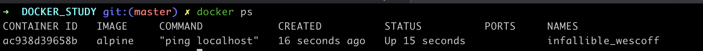
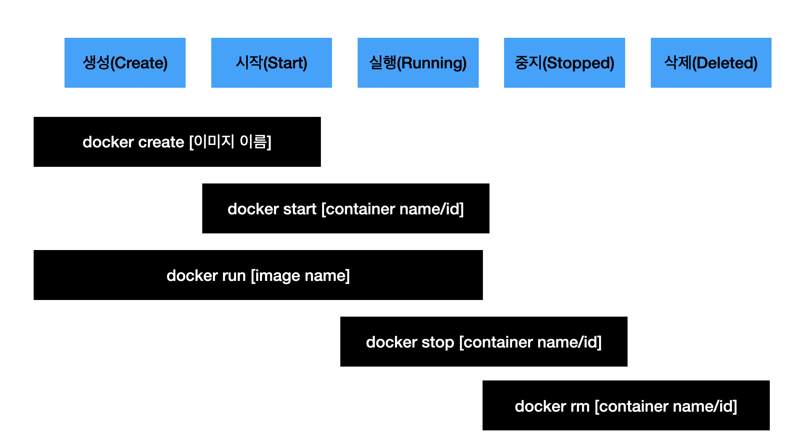

# 도커 이미지 내부 파일 구조 보기

```bash
docker run [이미지 이름]
```

docker : 클라이언트

run : 컨테이너 생성 및 실행

[이미지 이름] : 컨테이너를 위한 이미지


**작동 순서**

1. 도커 클라이언트에 명령어 입력 후 도커 서버로!
2. 서버에서 컨테이너 위한 이미지가 이미 캐시 되어 있는지,
3. 없다면 도커 허브에서 다운 받아오고 컨테이너 생성


**이미지로 컨테이너 생성하는 순서**

1. 먼저 파일 스냅샷 되어있는 것을 컨테이너의 하드 디스크에 올린다
2. 시작 커맨드를 이용하여 어플리케이션을 실행한다.


# 컨테이너들 나열하기

**현재 실행중인 컨테이너 나열**

```bash
docker ps
```



| container id          | image       | command               | created              | status | Ports                                          | names                |
| --------------------- | ----------- | --------------------- | -------------------- | ------ | ---------------------------------------------- | -------------------- |
| 컨테이너 고유 id 해시 | 도커 이미지 | 시작 시 실행될 명령어 | 컨테이너 생성된 시간 | 상태   | 컨테이너가 개방한 포트와, 호스트에 연결한 포트 | 컨테이너 고유한 이름 |


**원하는 항목만 보기**

--format 옵션 쓰면 된다!


# 도커 컨테이너의 생명주기



`docker run` = `docker create ` + `docker start`

