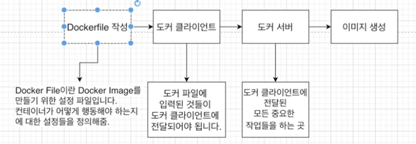

# 직접 도커 이미지를 만들어 보기

도커 허브에 이미 있는 이미지만 써왔는데, 직접 만들어 쓰는 것은 어떨까?
(물론 도커 허브에 업로드도 가능!)

```bash
docker create <image>
```


## 도커 이미지 생성하는 순서




## 도커 파일 만들기

**도커 파일이란?**

도커 이미지를 만들기 위한 설정 파일이며, 컨테이너가 어떻게 행동해야 하는지에 대한 설정들을 정의!


### 도커 파일 만드는 순서

> 도커 이미지가 필요한 것이 무엇인지 생각하자!

1. 베이스 이미지를 명시해준다. (파일 스냅샷에 해당)
2. 추가적으로 필요한 파일을 다운 받기 위한 몇 가지 명령어를 명시해준다. (파일 스냅샷에 해당)
3. 컨테이너 시작 시 실행 될 명령어를 명시해준다. (시작 시 실행될 명령어에 해당)

#### 베이스 이미지?

도커 이미지는 여러 개의 레이어로 되어 있는데,
그 중 베이스 이미지는 이 이미지의 기반이 되는 부분!

```dockerfile
# 베이스 이미지 명시
FROM baseImage
# 추가적으로 필요한 파일들 다운로드
RUN command
# 컨테이너 시작 시 실행 될 명령어 명시
CMD [ "executable" ]
```

- **FROM** 
  - 기반이 되는 이미지 레이어입니다.
  - <이미지 이름>:<태그> 형식으로 작성  ex) ubuntu:14.04

- **MAINTAINER** 
  - 메인테이너 정보입니다.

- **RUN** 
  - 도커이미지가 생성되기 전에 수행할 쉘 명령어

- **VOLUME** 
  - VOLUME은 디렉터리의 내용을 컨테이너에 저장하지 않고 호스트에 저장하도록 설정합니다. 
  - 데이터 볼륨을 호스트의 특정 디렉터리와 연결하려면 docker run 명령에서 -v 옵션을 사용해야 합니다.  ex) -v /root/data:/data

- **CMD**
  - 컨테이너가 시작되었을 때 실행할 실행 파일 또는 셸 스크립트입니다. 
  - 해당 명령어는 DockerFile내 1회만 쓸 수 있습니다.

- **WORKDIR**  
  - CMD에서 설정한 실행 파일이 실행될 디렉터리입니다.

- **EXPOSE** 
  - 호스트와 연결할 포트 번호입니다.


## 도커 파일로 도커 이미지 만들기

위에서 실제로는 다음과 같이 작성하게 됩니다.

```dockerfile
FROM alpine
CMD [ "echo", "hello" ]
```

도커 파일을 도커 클라이언트에 전달, 도커 서버가 인식하게 해야 함!

`docker build .` 를 통해 dockerfile 을 찾아서 **도커 클라이언트**에게 전달!


베이스 이미지에서 다른 종속성이나 새로운 커맨드를 추가할 때는
임시 컨테이너를 만든 후 그 **컨테이너를 토대로 새로운 이미지를 만든다!**
이후, 임시 컨테이너는 지워준다.

***이미지로 임시 컨테이너를 만들고, 다시 임시 컨테이너를 통해서 이미지를 만들게 된다!***

 

## 내가 만든 이미지 기억하기, 쉬운 이름 주기

빌드된 docker 이미지를 실행하기 위해선,

```bash
$ docker run -it 4fa59e3cf32a07c8dfa1d8cc1805e75e33f8c9f096a66d3a4
```

와 같이 ID를 입력해줘야 한다. 당연히 기억하기도 어렵다!

그래서, 이름을 부여하자!

```bash
$ docker build -t <나의 도커ID>/<저장소 or 프로젝트 이름>:<버전> .

$ docker build -t chulhee23/hello:latest .
```


실제 사용은 다음과 같이!

```bash
$ docker run -it chulhee23/hello

hello
```


