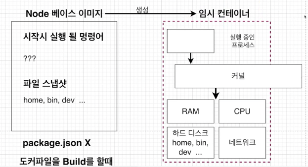
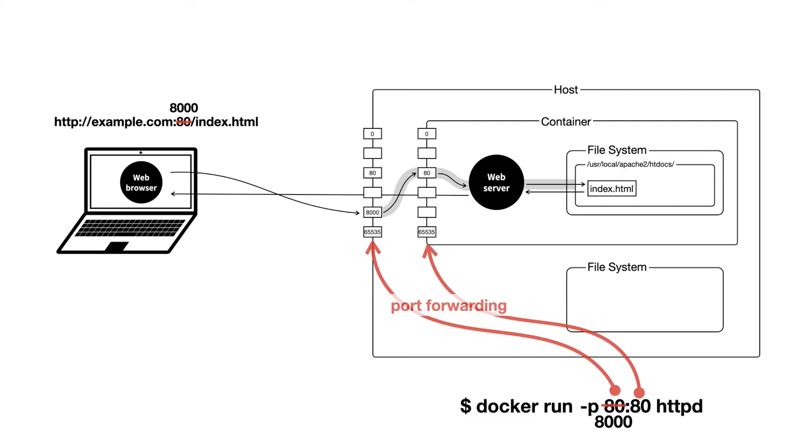
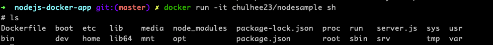

# 5. 도커를 이용한 간단한 Node.js 어플 만들기

## 5.1 섹션 설명

Node.js 공식 홈페이지에서 도커를 이용하는 예시를 통해 도커를 학습!


## 5.2 Node.js 앱 만들기

- package.json : 프로젝트의 정보와 프로젝트에서 사용 중인 패키지의 의존성을 관리
  - `npm init` 으로 만든다

- server.js : 시작점으로 가장 먼저 시작되는 파일

 `npm install express` 통해 express까지 설치하면,

```json
{
  "name": "nodejs-docker-app",
  "version": "1.0.0",
  "description": "",
  "main": "server.js",
  "scripts": {
    "test": "echo \"Error: no test specified\" && exit 1",
    "start": "node server.js"
  },
  "author": "",
  "license": "ISC",
  "dependencies": {
    "express": "^4.17.1"
  }
}
```


## 5.3 Dockerfile 작성하기

nodejs 앱을 도커 환경에서 실행하려면,
먼저 이미지를 생성 /  이미지 이용하여 컨테이너 실행 / 컨테이너 안에서 nodejs 앱을 실행

```dockerfile
FROM node:10

RUN npm install

CMD ["node", "server.js"]
```

- **FROM** 
  - npm이 alpine 에는 없기 때문에, node 이미지를 설치

- **RUN** 
  - `npm install `을 통해 package.json 내 필요한 종속성 설치

- **CMD**
  - node 서버 실행


## 5.4 package.json이 없다고 나오는 이유(dockerfile copy)



베이스 이미지의 파일 스냅샷을 임시 컨테이너의 하드디스크에 넣어주게 된다.

그 이후, npm install 진행 시 package.json 이 없다고 나오는 것!

npm install 할 때, package.json 의 종속성을 확인 후 다운로드 해야하는데, 
**package.json 이 컨테이너 안에 없고 컨테이너 밖에 있다!**
server.js도 마찬가지!

따라서, 도커 컨테이너 안으로 package.json 파일을 넣어줘야 한다!

> 근데, 그러면 server.js 는 왜 copy 안하지??

```bash
$ docker run -it chulhee23/nodesampleinternal/modules/cjs/loader.js:638
    throw err;
    ^

Error: Cannot find module '/server.js'
```

그래서 동일하게 server.js 가 없는 오류 발생!

모든 파일 COPY를 해버리자!

```dockerfile
FROM node:10

COPY ./ ./

RUN npm install

CMD ["node", "server.js"]
```

최종 도커에서 실행되는 것을 확인할 수 있다!

그런데... localhost:8080 에서 실행이 안된다?!


## 5.5 생성한 이미지로 어플리케이션 실행 시 접근이 안 되는 이유

이미지를 만들 때 로컬에 있던 파일 등을 컨테이너에 복사해줘야 정상 작동했다!

네트워크도 마찬가지로, 로컬 네트워크에 있던 것을 컨테이너 내부에 있던 네트워크에 연결 시켜줘야 한다!



https://www.youtube.com/watch?v=SJFO2w5Q2HI&list=PLuHgQVnccGMDeMJsGq2O-55Ymtx0IdKWf&index=5

```
docker run -p <외부포트>:<컨테이너 내부 포트> <image>
```


## 5.6 Working Directory 명시해주기

working directory를 따로 명시하는 이유?

- node 이미지 속 파일 스냅샷이 있는데,
  root 디렉토리 내부엔 home, bin 등 다양한 파일 존재



COPY 해서 들어온 것들이 root 디렉토리 내부에 존재!

**문제점**

1. 같은 이름의 파일이 원래 있었다면? 덮어씌워진다...!
2. 내 앱의 구성과 node 베이스 이미지 파일이 같은 위치에 존재하여 정리가 안되어 있다!

따라서, Working Directory를 따로 만들어주자!

Dockerfile 에 `WORKDIR /usr/src/app`로 명시해준 뒤, 빌드를 끝내면!

```bash
$ docker run -it chulhee23/nodesample sh
# ls
Dockerfile  node_modules  package-lock.json  package.json  server.js
# pwd
/usr/src/app
```

root 디렉토리부터 접속이 시작되는 것이 아닌, WORKDIR 부터 접근이 시작된다!


## 5.7 어플리케이션 소스 변경으로 다시 빌드하는 것에 대한 문제점

소스코드를 계속 변경시켜주면서 개발을 진행하지만, 
이미지를 재생성하기 전까지는 소스코드의 변경 내역이 바로 반영되진 않는다.

왜 빌드를 처음부터?

지금까지 우리가 했던 내용을 보면 알 수 있다!

WORKDIR 설정 이전, root 디렉토리에 파일들을 복사해뒀었는데, WORKDIR 설정 이후에도 root 디렉토리에 계속 이전의 내용을 가지고 있으면 안되니까!

이런 비효율 어떻게 개선할 수 있을까?


## 5.8 어플리케이션 소스 변경으로 재빌드 시 효율적으로 하는 법

npm은 dependency를 캐싱 처리하고 있다.

소스를 수정했는데 npm install 에서 캐시가 되지 않는다면?? 뭔가 문제가 있다!

종속성을 추가하지 않았음에도 dependency 를 다시 다운로드 받는 것은 매우 큰 비효율!

**해결**

package.json 만 먼저 copy 한 뒤 npm install 하면 해결!

그 이후 다른 파일들을 copy 해오면 npm install 을 다시 진행하지 않는다! (RUN command 로 직접 명시한거니깐!)

```bash
FROM node:10

WORKDIR /usr/src/app

COPY package.json ./

RUN npm install

COPY ./ ./

CMD ["node", "server.js"]
```

소스가 바뀌었다고 새롭게 npm install 하지 않는다!


## 5.9 Docker Volume 에 대하여

이제 package.json 만 따로 처리해두어 매번 module을 다시 받는 처리를 하지 않게 됐다!

하지만,
소스 변경할 때마다 

1. 새롭게 COPY 한 뒤 

2. 이미지를 다시 빌드
3. 컨테이너 실행

의 과정을 거쳐야 소스가 반영된다!

이 또한 매우 큰 불편이지 않을까?!

**따라서 Volume을 통해서 해결하자!**

Volume 은 도커 컨테이너가 로컬을 참조(Mapping)한다! 
직접 복사하는 것이 아니다!

```bash
docker run -p 5000:8080 -v /usr/src/app/node_modules -v $(pwd):/usr/src/app <image ID>
```

- ` -v /usr/src/app/node_modules`
  - 로컬(호스트)에 node_modules 없기에, 컨테이너에 매핑하지 말라고 명시
- `-v $(pwd):/usr/src/app`
  - 현재 위치의 파일이나 폴더를 /usr/src/app 경로에서 참조

`<참조할 로컬 위치>:<도커 참조하는 곳>`

