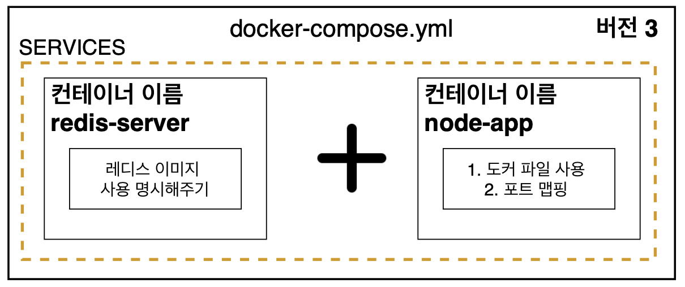

# 6. Docker Compose

## 6.1 Docker Compose란 무엇인가?

다중 컨테이너 도커 어플리케이션을 정의하고 실행하기 위한 도구!

간단한 앱을 예시로 만들어보자!
페이지를 리프레시하면 숫자가 1씩 올라가는 앱!


## 6.2 어플리케이션 소스 작성하기

express, redis 를 dependencies 로 설치

> redis 란?
>
> 메모리 기반의 key-value 구조 데이터 관리 시스템 (NoSql)
>
> 메모리에 저장하기 때문에 훨씬 빠르게 처리할 수 있으며 
> 메모리에 저장하더라도 영속적인 보관이 가능하다는 특징 있다!

```js
const express = require("express");
const redis = require("redis");
const PORT = 8080;


const client = redis.createClient({
    host: "redis-server",
    port: 6379
});

const app = express();

client.set("number", 0);

app.get('/', (req, res) => {
    client.get("number", (err, number) => {
        client.set("number", parseInt(number) + 1);
        res.send("add 1 to number: " + number);
    })
})

app.listen(PORT);
```

도커를 사용하지 않는 환경에서는 redis 서버의 host를 URL로,
docker compose를 사용하면 
host 옵션을 docker-compose.yml 파일에 명시한 컨테이너 이름으로 줘야한다!


## 6.3 Dockerfile 작성하기

```dockerfile
FROM node:10

WORKDIR /usr/src/app

COPY ./package.json .

RUN yarn install

COPY ./ ./

CMD ["node", "index.js"]
```


## 6.4 Docker Containers 간 통신할 때 나타나는 에러


노드 앱에서 레디스 클라이언트가 필요하니까, 먼저 레디스 서버를 켜두자!

```bash
$ docker run redis
```

이후 빌드 및 실행

```bash
$ docker build -t chulhee23/docker-compose-app .
$ docker run chulhee23/docker-compose-app
```

**하지만 에러 발생!**

```bash
$ docker run chulhee23/docker-compose-app       
events.js:174
      throw er; // Unhandled 'error' event
      ^

Error: Redis connection to redis-server:6379 failed - getaddrinfo ENOTFOUND redis-server redis-server:6379
    at GetAddrInfoReqWrap.onlookup [as oncomplete] (dns.js:56:26)
Emitted 'error' event at:
    at RedisClient.on_error (/usr/src/app/node_modules/redis/index.js:342:14)
    at Socket.<anonymous> (/usr/src/app/node_modules/redis/index.js:223:14)
    at Socket.emit (events.js:198:13)
    at emitErrorNT (internal/streams/destroy.js:91:8)
    at emitErrorAndCloseNT (internal/streams/destroy.js:59:3)
    at process._tickCallback (internal/process/next_tick.js:63:19)
```

컨테이너간 설정 없이는 서로 접근할 수 없다.

이런 멀티 컨테이너 상황에서 쉽게 네트워크를 연결시켜주기 위해 `docker compose`를 쓴다!


> Docker를 설치한 후 Host의 네트워크 인터페이스를 살펴보면 `docker0`라는 가상 인터페이스가 생긴다.
> `docker0`는 일반적인 가상 인터페이스가 아니며 도커가 자체적으로 제공하는 네트워크 드라이버 중 브리지(Bridge)에 해당


## 6.5 Docker Compose 파일 작성하기



```yaml
version: "3"
services:
  redis-server:
    image: "redis"
  node-app:
    build: .
    ports:
      - "5000:8080"
```

- version : docker compose의 버전
- services : 이곳에 실행하려는 컨테이너들을 정의
  - redis-server : 컨테이너 이름
    - image : 컨테이너에서 사용하는 이미지
  - node-app : 컨테이너 이름
    - build : 현 디렉토리에 있는 Dockerfile을 사용
    - ports : 포트 매핑 | 로컬포트 : 컨테이너 포트


## 6.6 docker compose로 컨테이너를 멈추기

`docker-compose down`으로 가능!


### docker-compose 명령어

- `docker-compose build`
  - 이미지 빌드만 하고, 컨테이너를 시작하지 않는다.
- `docker-compose up`
  - 이미지가 없으면 빌드하고(소스 내용 변경에 무관하게), 컨테이너를 시작
- `docker-compose up --build`
  - 필요하지 않을 때도 강제로 이미지를 빌드, 컨테이너를 시작
- `docker-compose up --no-build`
  - 이미지 빌드 없이 컨테이너를 시작

- `docker-compose up -d`
  - detached 모드로 켜서 , 앱을 백그라운드에서 실행 시킨다. 아웃풋 표출 안함
- `docker-compose down`
  - 컨테이너 멈추기

