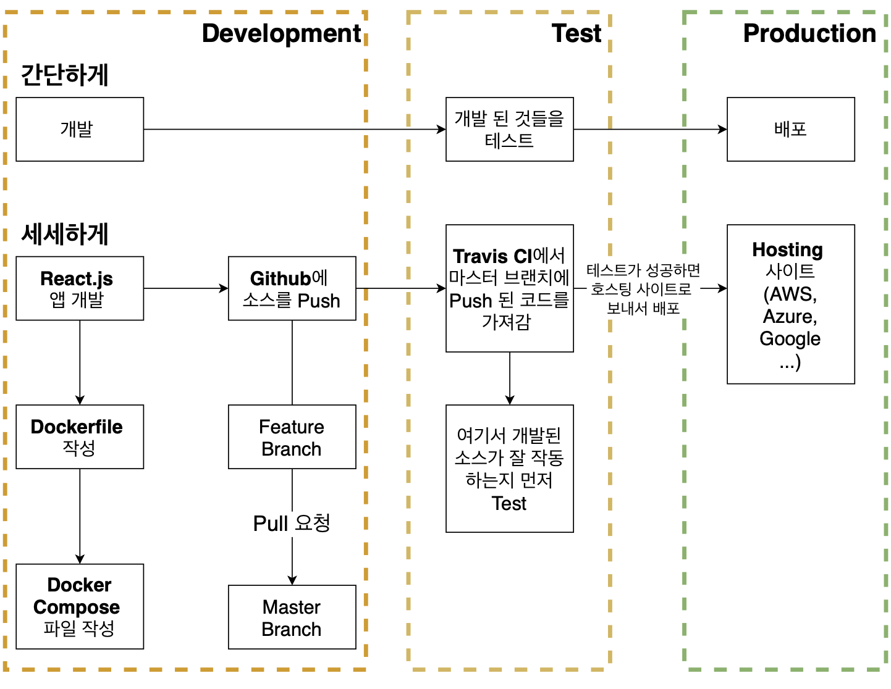

# 7. 간단한 어플을 실제로 배포해보기

## 7.1 섹션 설명

리액트 앱 테스트 & 배포!




## 7.2 리액트 앱 설치하기

노드가 설치되었는지만 먼저 확인! `node -v`

리액트 설치 `npx create-react-app ./`

- `yarn build`
  - 배포를 위한 명령어
  - 리액트로 생성한 프로젝트는 빌드하여 배포할 수 있는 버전으로 만들 수 있다!


## 7.3 도커를 이용하여 리액트 앱 실행하기


 개발 환경과 운영환경을 구분해서 dockerfile을 만드는 것이 좋다!

따라서 개발단계를 위해서 dockerfile.dev를 만들어보자!

```dockerfile
FROM node:alpine

WORKDIR /usr/src/app

COPY package.json ./

RUN yarn install

COPY ./ ./

CMD ["yarn", "run", "start"]
```

그대로 build 해보면 오류가 발생한다!
dockerfile.dev 는 있지만, dockerfile 이 없기 때문!

직접 명시해주자!
`docker build -f Dockerfile.dev .`

### COPY ./ ./ 문제 발생!

로컬에 node_modules 폴더를 다시 카피할 필요가 없다.
도커 환경에서 `yarn install` 통해서 node_modules 를 생성하기 때문! 
로컬의 node_modules 지워주자! (어차피 실행은 도커로 하니깐!)

> 혹은 .dockerignore 라는게 있던데, 이거 써주면 로컬 파일 업로드 안할듯!


## 7.4 생성된 도커 이미지로 리액트 앱 실행해보기

```bash
$ docker build -f Dockerfile.dev -t chulhee23/docker-react-app .
```

이전에 했던 것처럼 로컬 포트와 컨테이너 포트를 매핑해줘서 연결하자

```bash
$ docker run -p 3000:3000 chulhee23/docker-react-app 
```

만약에 위 명령어로 안될 경우 아래처럼 해볼 것!
-it 옵션을 추가로 주면,

- `docker run -it -p 3000:3000 chulhee23/docker-react-app ` 
  - -i : 상호 입출력 
  - -t : tty 활성화하여 bash 쉘 이용 가능


## 7.5 도커 볼륨을 이용한 소스코드 변경

>  도커 볼륨?
>
> COPY vs VOLUME
> VOLUME은 디렉터리의 내용을 컨테이너에 저장하지 않고 호스트에 저장하도록 설정!!
> 로컬의 내용을 매핑해준다!!

```bash
$ docker run -p 3000:3000 -v /usr/src/app/node_modules -v $(pwd):/usr/src/app <imageID>
```

빌드를 다시 안해줘도! 로컬 파일의 변경사항이 컨테이너에 바로 반영 가능!


## 7.6 도커 컴포즈로 좀 더 간단하게 앱 실행해보기

근데...

`$ docker run -p 3000:3000 -v /usr/src/app/node_modules -v $(pwd):/usr/src/app <imageID>` 너무 길고 불편!

-> docker-compose로 해결할 수 있다!


### **Docker-compose.yml 구성할 때**

```yaml
version: "3"
services:
  react:
    build:
      context: .
      dockerfile: Dockerfile.dev
    ports:
    - "3000:3000"
    volumes: 
    - /usr/src/app/node_modules
    - ./:/usr/src/app
    stdin_open: true
```


- version : docker compose의 버전
- services : 이곳에 실행하려는 컨테이너들을 정의
  - react : 컨테이너 이름
    - build : 현 디렉토리에 있는 Dockerfile 사용
      - context : 도커 이미지를 구성하기 위한 파일과 폴더들이 있는 위치
      - dockerfile : 도커파일 어떤 것을 사용할 것인지 지정
    - ports : 포트 매핑 | 로컬 포트 : 컨테이너 포트
    - volumes : 로컬 머신에 있는 파일들 매핑
    - stdin_open : 리액트 앱을 끌 때 필요 ( 리액트 자체 버그...!)


## 7.7 리액트 앱 테스트하기

기존엔 `yarn run test` 를 통해서 test를 진행.
도커 환경에서 돌려서 node_modules가 없다면 테스트를 할 수 없다!

###  도커를 이용한 리액트 앱에서 테스트하려면

```bash
docker run -it <image name> yarn run test
```


### 테스트 소스도 추가하면 바로 반영되면 좋겠다!

테스트 파일 변경이 있어도, 테스트를 돌리면 이전 테스트가 동일하게 돌아간다.

> volume 매핑을 한 것이 아니기 때문!


test 라는 컨테이너로 만들어주자!

```yml
version: "3"
services:
  react:
    build:
      context: .
      dockerfile: Dockerfile.dev
    ports:
    - "3000:3000"
    volumes: 
    - /usr/src/app/node_modules
    - ./:/usr/src/app
    stdin_open: true
  test:
    build:
      context: .
      dockerfile: Dockerfile.dev
    volumes: 
      - /usr/src/app/node_modules
      - ./:/usr/src/app
    command: ["yarn", "run", "test"]
```

test 부분을 추가해주고 `docker-compose up` 진행 시 테스트 소스가 변경될 경우 매핑된 파일의 내역이 변경된 것을 알아챌 수 있다.

> 근데 커맨드도 다시 실행하는구나...?!
>
> nodemon 처럼 소스 변경을 감지해서 서버를 재시작하니깐?!!

```yaml
testtwo:
    build:
      context: .
      dockerfile: Dockerfile.dev
    command: ["echo", "run"]
```

이런건 추가해도 재시작 하지 않는다. 매핑된 볼륨도 없고, 소스코드 변경이 감지되지 않으니까!


## 7.8 운영환경을 위한 Nginx

개발환경은 해봤으니까, 운영 환경을 확인해보자!

### 개발환경에서 리액트가 실행되는 과정

 

개발 서버 대신 nginx 서버가 제공해줘야한다!


Q. 개발 서버를 그대로 쓰면 되지 않는가?

A. 개발에 특화된 기능들을 제거하기 때문에 더 깔끔하고 빠른 nginx 쓴다.

> 물론 nginx 추가적인 장점들도 많겠지만 일단 현재 상황에서는?!


## 7.9 운영환경 도커 이미지를 위한 Dockerfile 작성하기

운영환경을 위해 nginx를 포함하는 리액트 이미지를 만들자!

가장 큰 차이는 빌드된 파일로 운영해야하기 때문에
dockerfile 의 CMD 에 `yarn run build` 를 사용한다.

이후 nginx 도커 이미지를 이용한 nginx 시작!


### 운영환경 Dockerfile 2단계

1. 빌드파일 생성 **(Builder Stage)**

2. nginx 를 가동하고, 
   1번에서 생성된 빌드 폴더의 파일들을 웹 브라우저의 요청에 따라 제공해준다. **(Run Stage)**

```dockerfile
FROM node:alpine as builder

WORKDIR /usr/src/app

COPY package.json ./

RUN yarn install

COPY ./ ./

CMD ["yarn", "run", "build"]

FROM nginx

COPY --from=builder /usr/src/app/build /usr/share/nginx/html
```


- `FROM node:alpine as builder`
  - 다음 FROM 까지 builder 스테이지임을 명시.
  - 이 스테이지의 목표는 빌드파일의 생성!
  - 생성된 파일과 폴더들은 /usr/src/app/build 로 들어간다!


- `FROM nginx`
  - `--from=builder`
    - 다른 Stage 의 파일을 복사할 때 다른 스테이지 이름을 명시!
  - ` /usr/src/app/build  /usr/share/nginx/html`
    - builder stage 에서 생성된 파일들은 build/ 아래에 있음
    - 이 파일들을 ` /usr/share/nginx/html` 로 복사하여 nginx 의 http 요청이 올 때마다 알맞은 파일을 전해줄 수 있게 만든다
  - ` /usr/share/nginx/html`
    - 이 곳으로 옮기는 이유는 nginx 설정. 알맞은 정적 파일 제공할 수 있고, 변경 가능


Nginx 의 기본 포트는 80 으로 매핑해주면 된다.

```bash
$ docker build -t chulhee23/docker-react-app . 
$ docker run -p 8080:80 chulhee23/docker-react-app
```

localhost:8080 접속하면 연결되는 것을 확인해볼 수 있다!


