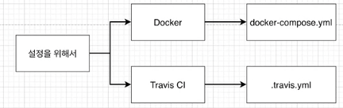
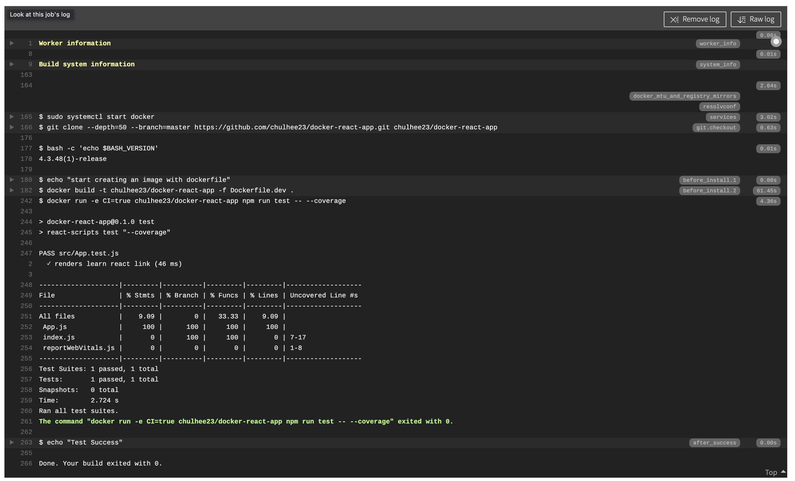
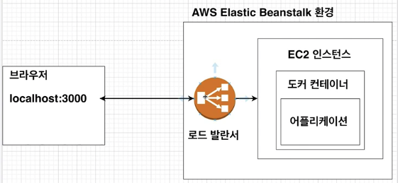
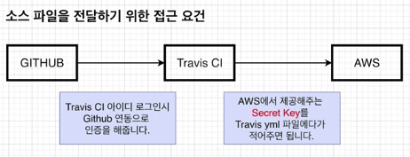
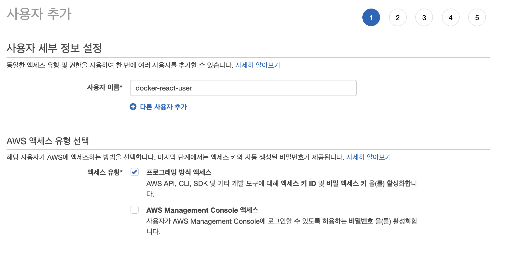
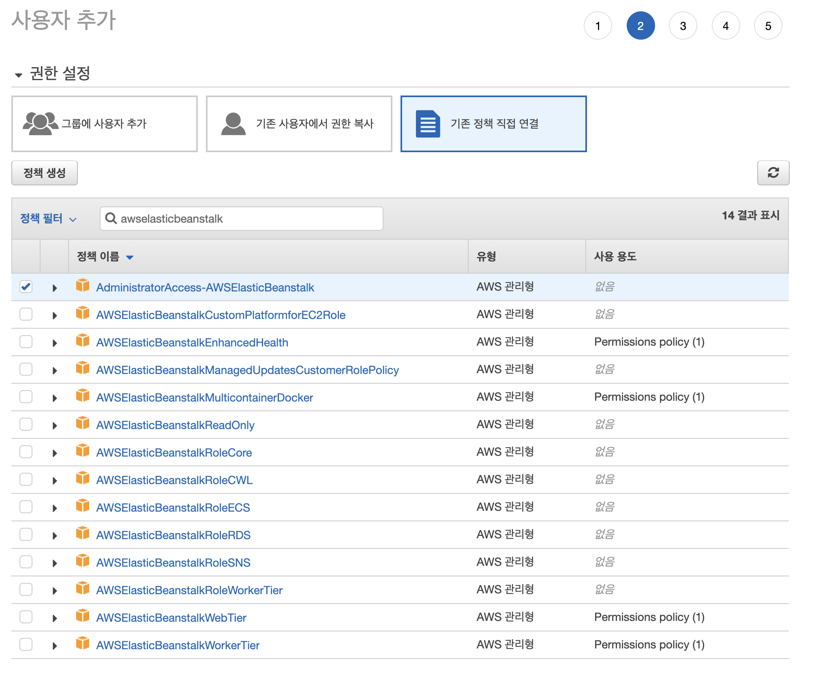
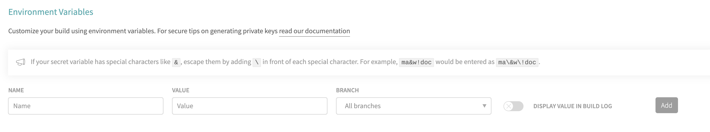
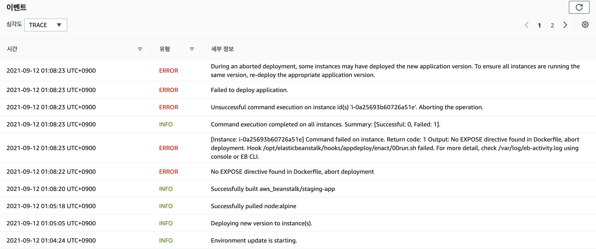
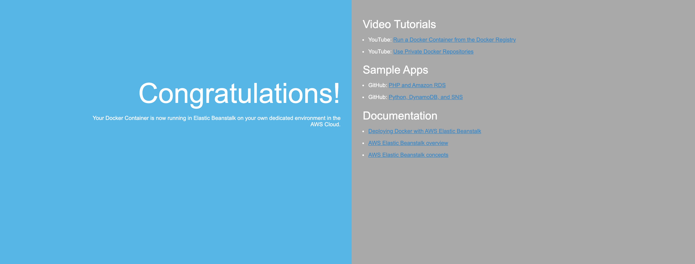
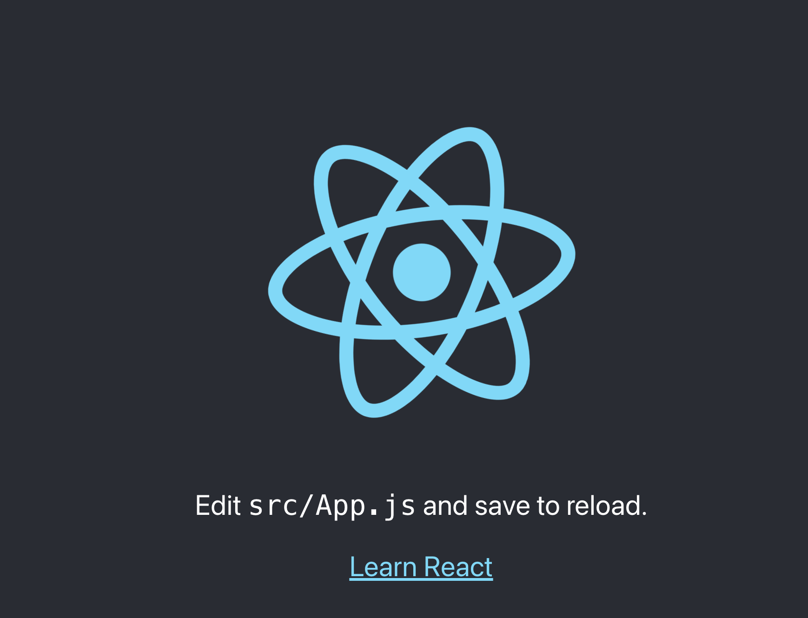

# 8. 간단한 어플을 실제로 배포해보기(테스트 & 배포 부분)


## 8.1 Github 에 소스 코드 올리기

-패스


## 8.2 Travis CI 설명

**Travis CI 는 깃헙에서 진행되는 오픈소스 프로젝트를 위한 CI 서비스!**

Travis CI를 이용하면 repo 에 있는 이벤트에 따라 자동으로 테스트, 빌드하거나 배포할 수 있다!


### Travis CI 의 흐름

1. 로컬 git 소스를 깃헙에 푸시한다.
2. github masterd에 push 가 되면 Travis CI 에게 소스가 푸시된 것을 알려준다.
3. Travis CI 는 업데이트된 소스를 가져와 테스트 코드를 실행
4. 테스트 성공 시 배포 진행

순서로 동작한다.


## 8.3 Travis CI 이용 순서

travis-ci.com 에서 가입 진행




## 8.4 .travis.yml 파일 작성하기(테스트까지)

```yml
# 관리자 권한갖기
sudo: required

# 언어(플랫폼) 선택
language: generic

# 도커 환경 구성
services:
  - docker

# 스크립트 실행 환경 구성
before_install:
  - echo "start creating an image with dockerfile"
  - docker build -t chulhee23/docker-react-app -f Dockerfile.dev .

# 실행 스크립트
script:
  - docker run -e CI=true chulhee23/docker-react-app npm run test -- --coverage
# --coverage : 더 자세한 내용 보기 위해

# 테스트 성공 후 할 일
after_success:
  - echo "Test Success"
```

처음에 버전 관련 로그 나오는데 무시 ㄱㅊ!


**최종 travis 로그는 다음과 같다!**




## 8.5 AWS 알아보기

- EC2
  - Elastic Compute Cloud
  - 한 대의 컴퓨터를 임대한다!
- EB
  - Elastic BeanStalk
  - Docker와 함께 개발된 웹 응용 프로그램 및 서비스를 배포하고 확장하기 쉬운 서비스!
  - EC2 인스턴스나 데이터베이스 같은 많은 것들을 포함한 **환경** 을 구성하며,
    만들고 있는 소프트웨어를 업데이트 할 때마다 자동으로 이 환경을 관리


## 8.6 Elastic Beanstalk 환경 구성하기

AWS 에서 EB 생성하면,
트래픽이 많지 않을 때는 EC2 하나로 감당!



많아지면 로드 밸랜서 하나에 여러 개의 EC2 로 트래픽을 분배한다!


## 8.7 .travis.yml 파일 작성하기

지금까지 도커 이미지 생성 후 어플 실행하여 테스트하는 부분까지 travis 설정 완료

이제는 테스트에 성공한 소스를 EB에 자동으로 배포하는 부분을 travis 파일에 넣어줄 차례!

```yml
# 관리자 권한갖기
sudo: required

# 언어(플랫폼) 선택
language: generic

# 도커 환경 구성
services:
  - docker

# 스크립트 실행 환경 구성
before_install:
  - echo "start creating an image with dockerfile"
  - docker build -t chulhee23/docker-react-app -f Dockerfile.dev .

# 실행 스크립트
script:
  - docker run -e CI=true chulhee23/docker-react-app npm run test -- --coverage

# 테스트 성공 후 할 일
after_success:
  - echo "Test Success"

deploy:
  provider: elasticbeanstalk # 외부 서비스 표시
  region: "ap-northeast-2" # 현재 AWS 물리적 장소
  app: "docker-react-app" # 생성된 application 이름
  env: "Dockerreactapp-env"
  bucket_name: "elasticbeanstalk-ap-northeast-2-610947587757" # 해당 eb 위한 s3 버킷 이름
  # travis 에서 가지고 있는 파일을 압축해서 S3로!

  bucket_path: "docker-react-app" # 어플리케이션 이름과 동일
  on:
    branch: master # 어떤 브랜치에 push 할 때 AWS 에 배포를 할 것인지

```

S3 는 환경 관련한 파일들 때문에 eb 생성 시 자동으로 s3 도 생성된다!


## Travis CI 의 AWS 접근을 위한 API 생성

현재까지 Travis CI 에서 AWS 에 어떤 파일을 전해줄 것이며,
어떤 서비스를 이용할 것이며,
부수적인 설정을 적어줬다!

하지만 Travis CI와 AWS 가 실질 통신할 수 있게 인증해주는 부분 설정 안했다!

인증 부분 확인해보자!



1. 깃헙에서 travis 로 소스 보낼 수 있는 이유?
   - 미리 GitHub 으로 연동해뒀기 때문!
2. Travis 에서 AWS 는?
   - secret key 를 등록해두자!

### secret, access API key 받기

IAM USER 생성하기!

**IAM ( Identity and Access Management)** 이란?
AWS 리소스에 대한 액세스를 안전하게 제어할 수 있는 웹 서비스

- root 사용자
  - 현재 우리가 가입해서 사용하는 계정
  - AWS 서비스 및 리소스에 대한 완전한 액세스 권한 있음!!
- IAM 사용자
  - root 사용자가 부여한 권한만 가지고 있음





액세스키를 발급 받고, 노출되지 않도록 관리해줘야 합니다.

Travis-ci.com 에서 연결한 저장소의 환경변수로 추가!



yml 파일에 다음 환경 변수로 deploy 하겠다고 명시!

```yml

deploy:
  provider: elasticbeanstalk # 외부 서비스 표시
  region: "ap-northeast-2" # 현재 AWS 물리적 장소
  app: "docker-react-app" # 생성된 application 이름
  env: "Dockerreactapp-env"
  bucket_name: "elasticbeanstalk-ap-northeast-2-610947587757" # 해당 eb 위한 s3 버킷 이름
  # travis 에서 가지고 있는 파일을 압축해서 S3로!

  bucket_path: "docker-react-app" # 어플리케이션 이름과 동일
  on:
    branch: master # 어떤 브랜치에 push 할 때 AWS 에 배포를 할 것인지
  access_key_id: $AWS_ACCESS_KEY
  secret_access_key: $AWS_SECRET_ACCESS_KEY
  
```

이제 github 에 푸쉬해보자!

travis ci 에선 정상적으로 동작 완료 가능하다!

AWS 에서 새로 온 소스로 배포를 하려고 하지만, 에러가 발생한다!






이유는??

Nginx 의 포트 매핑을 해주지 않았다!

```dockerfile
FROM node:alpine as builder
WORKDIR '/usr/src/app'
COPY package.json ./
RUN yarn install
COPY ./ ./
CMD yarn run build

FROM nginx
EXPOSE 80
COPY --from=builder /usr/src/app/build /usr/share/nginx/html
```

`EXPOSE 80` 작성해주고, push 하면 docker EB 화면이 아닌, 리액트 서비스로 정상 작동~!



