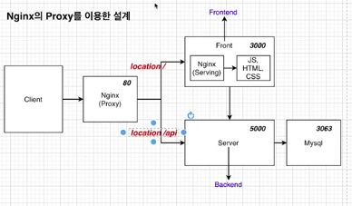
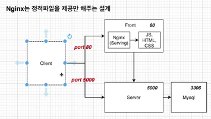
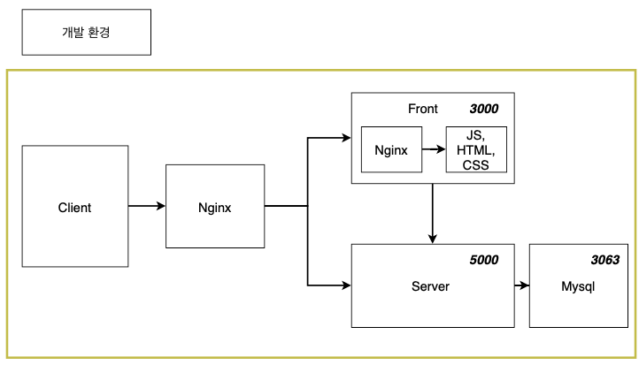
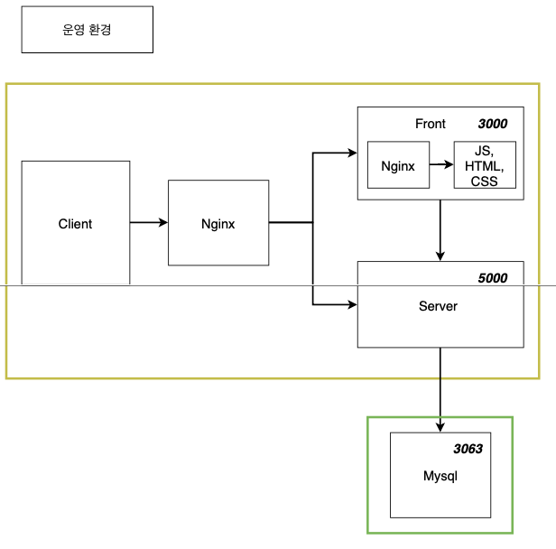
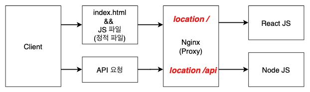

# 9. 복잡한 어플을 실제로 배포해보기


## 섹션 설명

조금 더 복잡하게 만들어보자!
멀티 컨테이너 상태로~!


### Nginx 의 Proxy 이용한 설계



- 장점
  - Request를 보낼 때 URL host 이름이 바뀌어도 변경할 필요 없음!
  - 포트가 바뀌어도 변경을 안해줘도 된다!
- 단점
  - nginx 설정 및 전체 설계가 복잡


### Nginx 정적파일을 제공만 해주는 설계



- 장점
  - 설계가 간단하여 구현이 쉬움
- 단점
  - host name이나 포트 변경 있으면 request URL 도 변경해줘야 한다!


**Nginx 를 Proxy 서버로 쓰는 구성을 만들어보자!**


## Node JS 구성하기

- package.json

```json
{
  "name": "backend",
  "version": "1.0.0",
  "description": "",
  "main": "index.js",
  "scripts": {
    "test": "echo \"Error: no test specified\" && exit 1",
    "start": "node index.js",
    "dev": "nodemon index.js"
  },
  "dependencies": {
    "express": "4.16.3",
    "mysql": "2.16.0",
    "nodemon": "1.18.3",
    "body-parser": "1.19.0"
  },
  "author": "",
  "license": "ISC"
}

```

- index.js

```js
const express = require("express");
const bodyParser = require("body-parser");

const db = require("./db");

const app = express();

// json 형태로 오는 요청의 본문 해석
app.use(bodyParser.json());

// 테이블 생성
db.pool.query(`CREATE TABLE lists (
    id INTEGER AUTO_INCREMENT,
    value TEXT,
    PRIMARY KEY (id)
)`, (err, results, fields) => {
    console.log('results', results)
})


// db 목록 보내주기
app.get('/api/values', function (req, res) {
    db.pool.query('SELECT * FROM lists;',
        (err, results, fields) => {
            if (err)
                return res.status(500).send(err);
            else
                return res.json(results);
        })
})

// 입력값 db 넣기
app.post('/api/value', function (req, res, next) {
    db.pool.query(`INSERT INTO lists (value) VALUES("${req.body.value}")`,
        (err, results, fields) => {
            if (err)
                return res.status(500).send(err);
            else
                return res.json({ success: true, value: req.body.value });
        })
})


app.listen(5000, () => {
    console.log("Running on port 5000")
})
```

- db.js

```js
const mysql = require("mysql")
const pool = mysql.createPool({
    connectionLimit: 10,
    host: 'mysql',
    user: 'root',
    password: "password",
    database: 'myapp'
})
exports.pool = pool;
```


## React JS 구성하기

```js
import React, { useState, useEffect } from 'react';
import logo from './logo.svg';
import './App.css';
import axios from 'axios';

function App() {

  // db 값을 가져온다
  useEffect(() => {
    axios.get('/api/values')
      .then(response => {
        console.log('response', response)
        setLists(response.data)
      })
  }, [])

  
  const [lists, setLists] = useState([])
  const [value, setValue] = useState("")

  const changeHandler = (event) => {
    setValue(event.currentTarget.value)
  }

  const submitHandler = (event) => {
    event.preventDefault();

    axios.post('/api/value', { value: value })
      .then(response => {
        if (response.data.success) {
          console.log('response', response)
          setLists([...lists, response.data])
          setValue("");
        } else {
          alert('값을 DB에 넣는데 실패했습니다.')
        }
      })
  }

  return (
    <div className="App">
      <header className="App-header">
        
        
        <div className="container">
          <form className="example" onSubmit={submitHandler}>
            <input 
              type="text"
              placeholder="입력해주세요"
              onChange={changeHandler}
            />
            <button type="submit">확인</button>
          </form>

        </div>
      </header>
    </div>
  );
}

export default App;
import React, { useState, useEffect } from 'react';
import logo from './logo.svg';
import './App.css';
import axios from 'axios';

function App() {

  // db 값을 가져온다
  useEffect(() => {
    axios.get('/api/values')
      .then(response => {
        console.log('response', response)
        setLists(response.data)
      })
  }, [])

  
  const [lists, setLists] = useState([])
  const [value, setValue] = useState("")

  const changeHandler = (event) => {
    setValue(event.currentTarget.value)
  }

  const submitHandler = (event) => {
    event.preventDefault();

    axios.post('/api/value', { value: value })
      .then(response => {
        if (response.data.success) {
          console.log('response', response)
          setLists([...lists, response.data])
          setValue("");
        } else {
          alert('값을 DB에 넣는데 실패했습니다.')
        }
      })
  }

  return (
    <div className="App">
      <header className="App-header">
        
        
        <div className="container">
          <form className="example" onSubmit={submitHandler}>
            <input 
              type="text"
              placeholder="입력해주세요"
              onChange={changeHandler}
            />
            <button type="submit">확인</button>
          </form>

        </div>
      </header>
    </div>
  );
}

export default App;

```


## 리액트 앱을 위한 도커 파일 만들기

- dockerfile.dev

```dockerfile
FROM node:alpine

WORKDIR /app

COPY package.json ./

RUN npm install

COPY ./ ./

CMD [ "yarn", "start" ]
```

- dockerfile

```dockerfile
FROM node:alpine as builder
WORKDIR /app
COPY package.json ./
RUN npm install
COPY ./ ./

RUN npm run build

FROM nginx
EXPOSE 3000
COPY ./nginx/default.conf /etc/nginx/conf.d/default.conf
COPY --from=builder /app/build  /usr/share/nginx/html
```

컨테이너 내의 default.conf 경로로 복사해두기!


- nginx default.conf

```conf
server {
  listen 3000;
  location / {
    root /usr/share/nginx/html; # html 파일 위치할 루트 설정
    index index.html index.htm; # 사이트의 index 페이지로 할 파일명 설정
    try_files $uri $uri/ /index/html # react Router 사용해서 페이지간 이동을 할 때 이 부분 필요
  }
}
```

**react 는 SPA 이기 때문에 하나의 index.html 만 있다.**

{url}/home 해도 index.html 파일에 접근해서 라우팅을 시켜야 하는데, nginx 에선 이를 알 수 없다.
따라서 /home 에 매칭되는 것이 없을 땐 index.html 제공해서 /home 으로 라우팅 시켜주도록 **임의로 설정**


## 노드 앱을 위한 도커 파일 만들기

- dockerfile.dev

```dockerfile
FROM node:alpine

WORKDIR /app

COPY ./package.json ./

RUN npm install

COPY . .

CMD ["npm", "run", "dev"]
```


- dockerfile

```dockerfile
FROM node:alpine

WORKDIR /app

COPY ./package.json ./

RUN npm install

COPY . .

CMD ["npm", "run", "start"]
```


## DB 에 관해서

개발환경, 운영환경 분리!

>  왜?
>
> 중요 정보를 다루는 운영환경에선, AWS RDS 를 활용하여 DB를 구성하는 것이 실제로 안전 + 보편적!






## MySQL을 위한 도커 파일 만들기

### Dockerfile

```dockerfile
FROM mysql:5.7

ADD ./my.cnf /etc/mysql/conf.d/my.cnf
```

### sqls/initialize.sql

```sql
DROP DATABASE IF EXISTS myapp;

CREATE DATABASE myapp;
USE myapp;

CREATE TABLE lists (
    id INTEGER AUTO_INCREMENT,
    value TEXT
    PRIMARY KEY (id)
);
```

### my.cnf

```text
[mysqld]
character-set-server=utf8

[mysql]
default-character-set=utf8

[client]
default-character-set=utf8
```


## Nginx를 위한 도커 파일 만들기

nginx 사용 이유

- proxy 서버 기능
- 정적 파일 제공




클라이언트의 요청에 따라 분리하여 제공한다!

Nginx 폴더를 만들고, default.conf 파일을 작성한다.

```tex
# 3000 번 포트에서 frontend
upstream frontend {
  server frontend:3000;
}

# 5000번 포트 backend
upstream backend {
  server backend:5000;
}

# nginx 는 80 포트로 연다
server {
  listen 80;
  
  location / {
    proxy_pass http://frontend;
    # 도커환경이므로 docker-compose의 서비스 이름으로 작성 가능
    # 원래는 ip 주소를 기입한다던지 등의 형태로 작성해야함!
  }
  
  location /api {
    proxy_pass http://backend;
  }
  
  location /sockjs-node {
    # 리액트 개발 환경 관련 오류 처리
    proxy_pass http://frontend;
    proxy_http_version 1.1
    proxy_set_header Upgrade $http_upgrade;
    proxy_set_header Connection "Upgrade";
  }
}
```


## Docker Compose 파일 작성하기

각각의 컨테이너를 위한 도커파일 작성 완료!
**이를 서로 연결시켜주기 위해, 모든 컨테이너를 한번에 실행하기 위해**
Docker-copmose 파일을 작성해보자!

```yml
version: "3"
services:
  frontend:
    # 개발 환경을 위한 dockerfile 위치
    build: 
      dockerfile: Dockerfile.dev
      context: ./frontend
    volumes:
      - /app/node_modules # work_dir : app
      - ./frontend:/app # work_dir 에서 참조할 수 있도록
    stdin_open: true
  
  nginx:
    restart: always
    build:
      dockerfile: Dockerfile
      context: ./nginx
    ports:
      - "3000:80"

  backend:
    build:
      dockerfile: Dockerfile.dev
      context: ./backend
    container_name: app_backend
    volumes:
      - /app/node_modules
      - ./backend:/app

  mysql:
    build: ./mysql
    restart: unless-stopped
    container_name: app_mysql
    ports:
      - "3306:3306"
    volumes:
      - ./mysql/mysql_data:/var/lib/mysql
      - ./mysql/sqls/:/docker-entrypoint-initdb.d/
    environment:
      MYSQL_ROOT_PASSWORD: "password"
      MYSQL_DATABASE: myapp
```

nginx restart 설정

- no : 어떠한 상황에서도 재시작을 하지 않는다.
- always : 항상 재시작!
- on-failure : on-failure 에러코드와 함께 컨테이너가 멈추었을 때만 재시작
- unless-stopped : 개발자가 임의로 멈출 때 제외하고 항상 재시작


## Volume을 이용한 데이터베이스 데이터 유지하기

mysql의 volumes 무엇을 하는지??

데이터베이스의 저장된 자료가 container가 지워지더라도
 자료가 지워지지 않게 해주기 위한 volume

> VOLUME은 디렉터리의 내용을 컨테이너에 저장하지 않고 호스트에 저장하도록 설정!
> 로컬의 내용을 매핑할 때 썼었는데, 이런식으로 작성도 가능하네?!


**컨테이너에서 변화가 일어난 데이터가 컨테이너 안에 저장되는 것이 아닌,**
**호스트 파일 시스템에 저장되고,** 
**그 중에서도 도커에 의해서만 통제가 되는 도커의 area 에 저장되므로**
**컨테이너 삭제해도 변화된 데이터는 삭제되지 않는다!**


