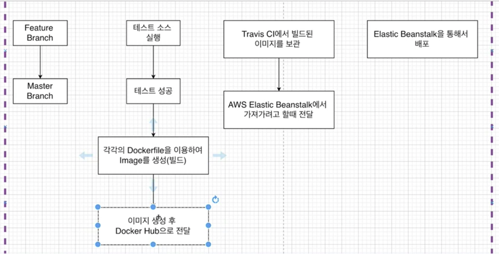
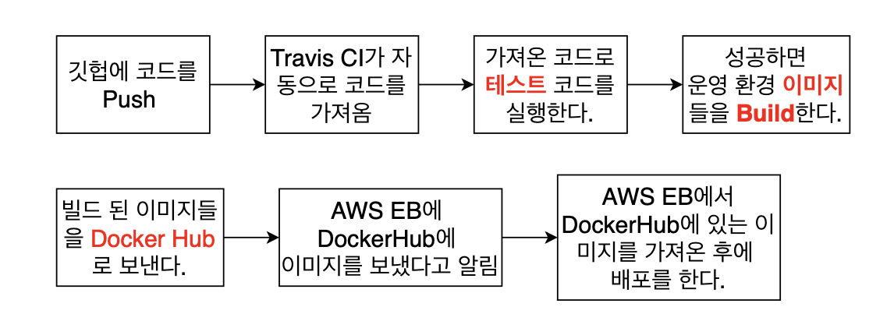
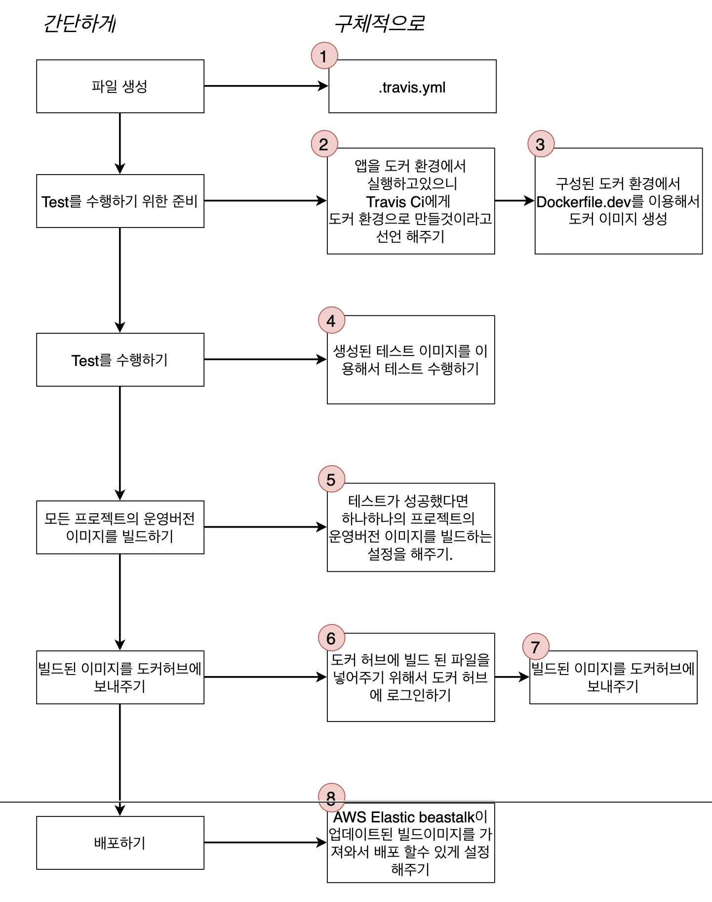
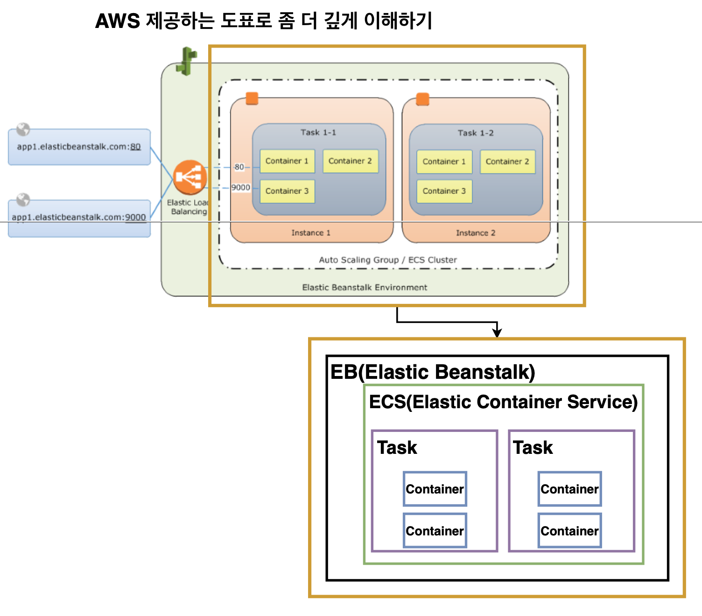
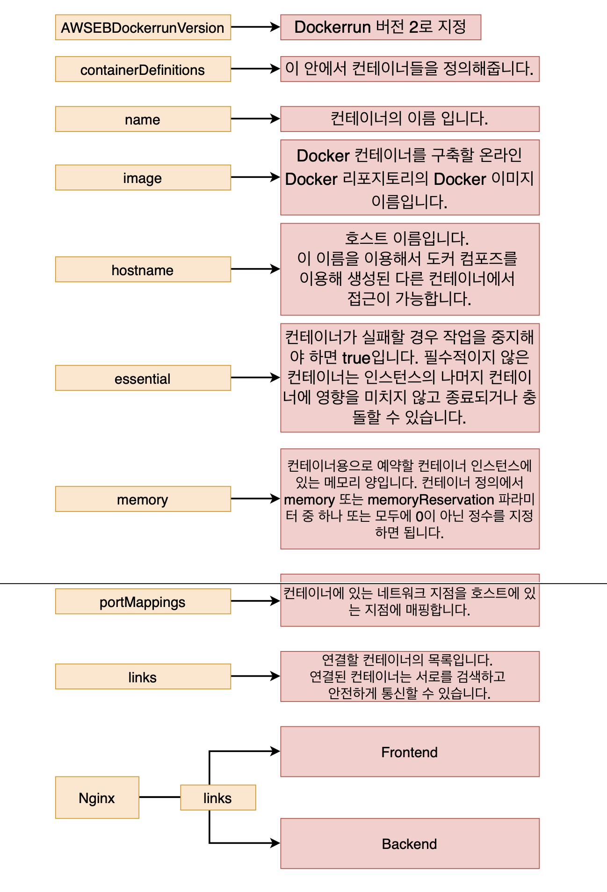
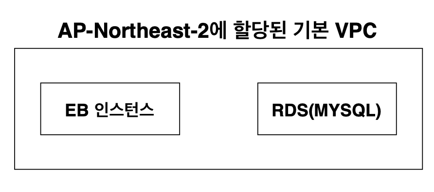
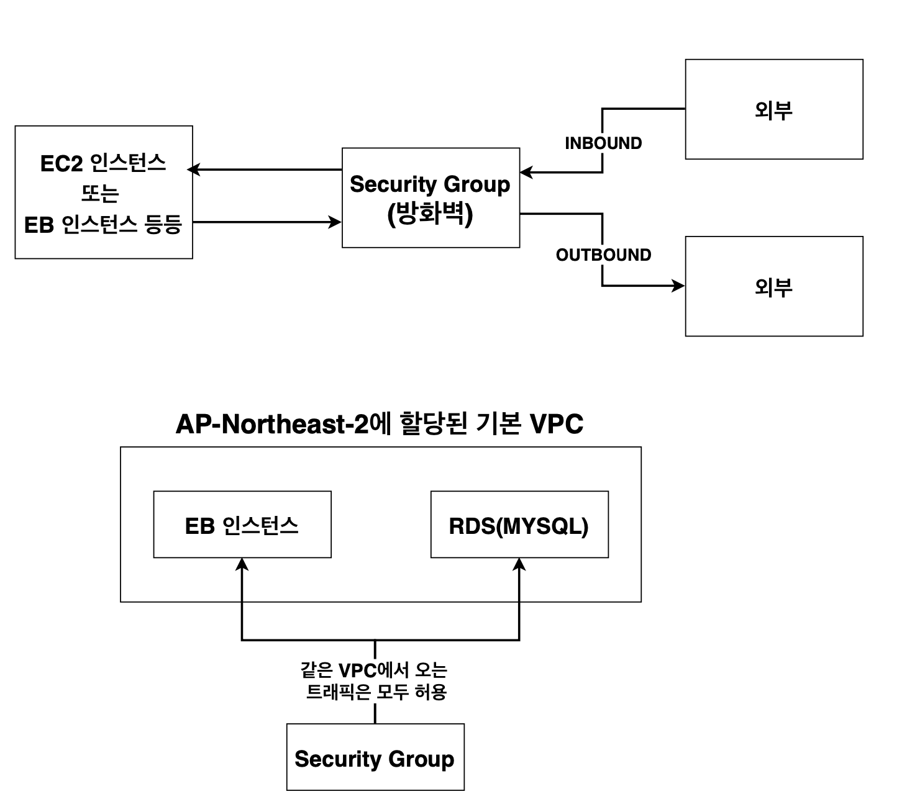
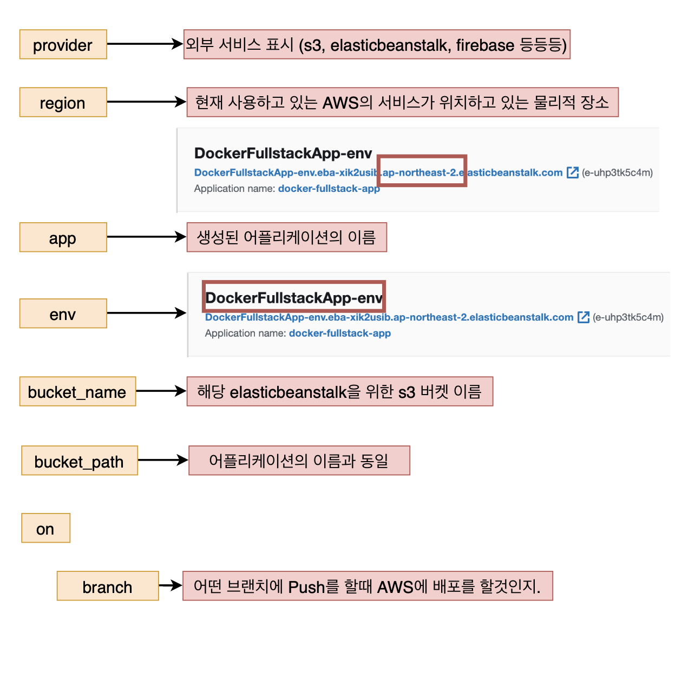
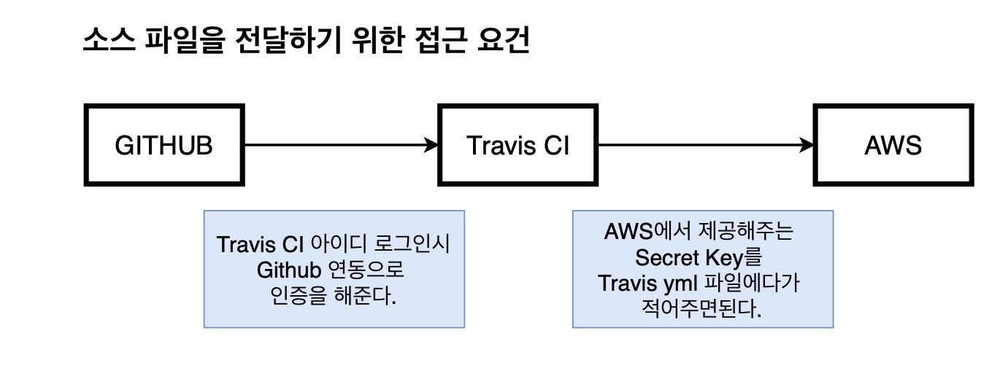

# 10. 복잡한 어플을 실제로 배포해보기

9장에선 어플리케이션을 위한 전체 소스코드를 작성하고,
각각에 맞는 Dockerfile 을 작성했으며 
그 각각의 컨테이너를 연결시켜주고 간단하게 한번에 실행시킬 수 있는 Docker Compose 를 작성!

이번엔, 
**소스코드가 에러가 없는지 테스트를 한 후, 테스트에서 성공을 하면 <- Travis CI 의 역할**

AWS 를 통해서 배포하는 것 까지 진행!

(데이터베이스를 운영환경에서는 도커를 이용하는 것이 아닌, AWS RDS를 이용하므로
MYSQL 부분의 수정 필요)


### 배포 진행 순서

이전엔 소스코드 작성 -> dockerfile 작성 -> docker-compose 작성이였다면,

1. github 에 push
   - feature branch -> master branch
2. Travis CI
   - 테스트 소스 실행
   - 테스트 성공
   - 각각의 Dockerfile 이용하영 Image 생성 (빌드)
   - 이미지 생성 후 Docker Hub 으로 전달
3. Docker Hub
   - travis CI에서 빌드된 이미지를 보관
   - AWS EB에서 가져가려고 할 때 전달
4. AWS EB
   - EB 통해서 배포




## 도커 환경의 MYSQL 부분 정리하기

도커 환경에서 돌리지 않고, aws 에서 돌리자!

docker-compose.yml 에서 mysql 부분 제거!


## github 에 소스 코드 올리기

.gitignore 설정하기


## Travis CI Steps




## .travis.yml 파일 작성하기




## Dockerrun.aws.json 에 대해서

**Dockerrun.aws.json 필수!**

리액트 앱 하나 만들 때는 dockerfile 하나로 EB 에서 해결 가능!

멀티 컨테이너 상황에서는 dockerfile 이 여러 개이므로, EB가 어떤 파일을 먼저 실행하고 어떤 행동을 할 지 알아야 할 필요가 있다!

### Dockerrun.aws.json

`Dockerrun.aws.json` 파일은 docker 컨테이너 세트를 EB 애플리케이션으로 배포하는 방법을 설명하는 EB 고유의 json 파일이다. `Dockerrun.aws.json` 파일을 멀티 컨테이너 docker 환경에 사용할 수 있다.

`Dockerrun.aws.json` 은 
환경에서 각 컨테이너 인스턴스(Docker 컨테이너를 호스트하는 Amazon EC2 인스턴스)에 배포할 컨테이너 및 탑재할 컨테이너의 호스트 인스턴스에서 생성할 데이터 볼륨을 설명!

> 쉽게 말하자면, 어떻게 다중 컨테이너를 작동시킬지 알려준다!!



task 에 어떻게 컨테이너를 실행할지 정의한다.

작업 정의를 등록할 떄는 Container Definition을 명시해줘야한다.

Dockerrun.aws.json 안에 Container Definition을 넣어준다!

### AWS 에서 말하는 Task Definition(작업 정의)에서 지정할 수 있는 것들

- 작업의 각 컨테이너에 사용할 도커 이미지
- 각 작업 또는 작업 내 각 컨테이너에서 사용할 CPU 및 메모리 양
- 사용할 시작 유형으로서 해당 작업이 호스팅되는 인프라를 결정
- 작업의 컨테이너에 사용할 도커 네트워킹 모드
- 작업에 사용할 로깅 구성
- 컨테이너가 종료 또는 실패하더라도 작업이 계속 실행될지 여부
- 컨테이너 시작 시 컨테이너가 실행할 명령
- 작업의 컨테이너에서 사용할 데이터 볼륨
- 작업에서 사용해야 하는 IAM 역할

작업 정의의 내용이 도커 데몬으로 전해진다!


## Dockerrun.aws.json 파일 작성하기



```json
{
  "AWSEBDockerrunVersion": 2,
  "containerDefinitions": [
    {
      "name": "frontend",
      "image": "chulhee23/docker-frontend",
      "hostname": "frontend",
      "essential": false,
      "memory": 128
    },
    {
      "name": "backend",
      "image": "chulhee23/docker-backebd",
      "hostname": "backend",
      "essential": false,
      "memory": 128
    },
    {
      "name": "nginx",
      "image": "chulhee23/docker-nginx",
      "hostname": "nginx",
      "essential": true,
      "portMappings": [
        {
          "hostPort": 80,
          "containerPort": 80
        }
      ],
      "links": ["frontend", "backend"],
      "memory": 128
      
    }
  ]

}
```


## 다중 컨테이너 앱을 위한 Elastic beanstalk 환경 생성

aws console에서 생성!


## VPC(virtual private cloud)와 Security Group 설정하기

EB 와 RDS 연결 되어있지 않기에 따로 설정 필요!

### VPC 란?

**Amazon Virtual Private Cloud** 를 사용하면 AWS 클라우드에서 논리적으로 격리된 공간을 프로비저닝(제공)하여 고객이 정의하는 가상 네트워크에서 AWS 리소스를 시작할 수 있다.


EB 인스턴스나 RDS 생성하면 자동으로 기본 VPC가 할당된다. 
또한 할당이 될 때 지역별로 다르게 할당된다. 
즉, 타 지역에선 내 계정에서도 다른 지역의 EB를 볼 수 없다!





같은 VPC 에서 오는 트래픽을 모두 허용해서 통신할 수 있게 해주자!


## MYSQL을 위한 AWS RDS 생성하기

AWS RDS에서 생성


## Security Group 생성하기

EB 인스턴스와 RDS가 서로 요청을 보낼 수 있게 Security Group을 생성한다!

- 인바운드 규칙
  - 외부에서 EC2 인스턴스나 EB 인스턴스로 요청을 보내 트래픽
  - HTTP, HTTPS, SSH 등이 존재
- 아웃바운드 규칙
  - EC2 인스턴스나 EB 인스턴스 등에서 외부로 나가는 트래픽
  - 파일을 다운로드하거나, inbound 로 들어온 트래픽을 처리하여 응답하는 경우도 포함


인바운드 규칙으로 mysql 포트인 3306 포트만 열어준다!


## Security Group 적용하기

위에서 생성한 security group을 eb와 rds에 적용해본다.


## EB와 RDS 소통을 위한 환경 변수 설정하기

보안그룹은 설정했지만, 컨테이너들이 mysql의 환경 변수를 인식하지는 못하고 있다.

이를 처리해보자!


## travis.yml 파일 작성하기 (배포 부분)

현재 각각의 필요한 이미지들을 빌드한 후 
도커 허브에 push 해주었다.
이제는 AWS 에서 배포를 위해 필요한 설정을 travis.yml 파일에 추가해주자!




## Travis CI의 AWS 접근을 위한 API key 생성



root 계정 사용은 보안을 위해 좋지 않으므로 IAM 유저 생성해서 쓰자!

