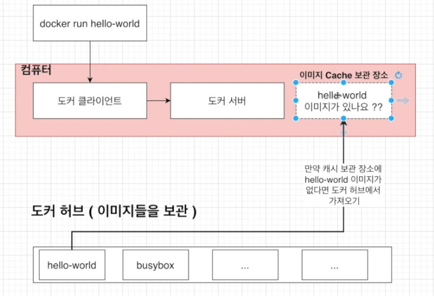
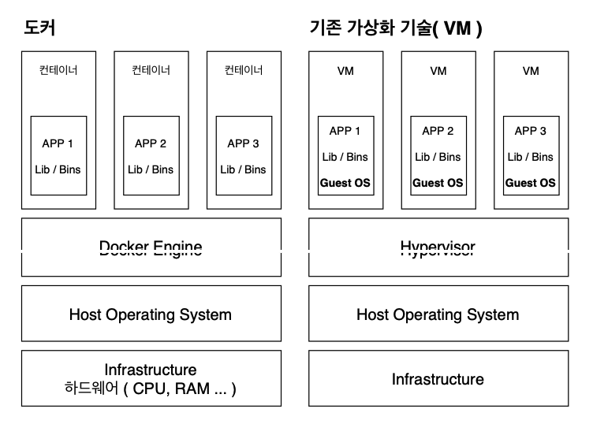

# 1. 도커 기본

## 1.1 도커를 쓰는 이유

어떠한 프로그램을 다운 받는 과정을 굉장히 간단하게 만들기 위해서입니다.

도커 없이 프로그램을 받는다고 생각하면 Installer를 다운받고 이를 실행시켜야 합니다.

하지만 서버, 패키지 버전, 운영체제 등에 따라 프로그램을 설치하는 과정 중에 많은 에러가 발생합니다.

또한 설치 과정이 다소 복잡합니다.

이러한 문제를 도커를 쓰면 비교적 간편하고 안정적으로 해결할 수 있습니다.


## 1.2 도커란 무엇인가?

### 도커란 무엇인가

도커는 `컨테이너`를 사용하여 응용프로그램을 더 쉽게 만들고 배포하고 실행할 수 있도록 설계된 도구이며 컨테이너 기반의 오픈소스 가상화 플랫폼이며 생태계입니다.


### 컨테이너란 무엇인가

일반적인 컨테이너의 개념은 그 안에 물건을 넣고 다양한 운송수단으로 옮길 수 있습니다.

서버에서의 컨테이너는 다양한 프로그램, 실행환경을 컨테이너로 추상화하고 동일한 인터페이스를 제공하여 프로그램의 배포 및 관리를 단순하게 해줍니다.

일반 컨테이너에서 물건을 손쉽게 운송 해주는 것 처럼 프로그램을 손쉽게 이동 배포 관리 할 수 있게 해줍니다.

AWS, Azure, Google Cloud 등 어디에서든 실행 가능하게 해줍니다.


## 1.3 도커 이미지와 도커 컨테이너 정의

**컨테이너**는 코드와 모든 종속성을 패키지화하여 응용 프로그램이 한 컴퓨팅 환경에서 다른 컴퓨팅 환경으로 빠르고 안정적으로 실행되도록 하는 소프트웨어의 표준 단위입니다.


**컨테이너 이미지**는 코드, 런타임, 시스템 도구, 시스템 라이브러리 및 설정과 같은 응용 프로그램을 실행하는 데 필요한 모든 것을 포함하는 가볍고 독립적인 실행 가능한 소프트웨어 패키지입니다.


정리하면 도커 이미지는 프로그램을 실행하는데 필요한 설정이나 종속성을 갖고 있으며 도커 이미지를 이용해서 컨테이너를 생성하며 도커 컨테이너를 이용하여 프로그램을 실행합니다.


## 1.4 MAC OS를 위한 도커 설치

OS 버전에 맞도록 Docker를 다운로드합니다.

https://www.docker.com/get-started


마찬가지로 위 사이트에서 계정을 만들어줍니다.


도커가 설치되었는지 확인하기 위해 버전을 확인해볼 수 있습니다.

```shell
docker --version
```

```
Docker version 20.10.7, build f0df350
```


## 1.5 도커를 사용할 때의 흐름

1. 도커 CLI에 커맨드를 입력합니다.
2. 그러면 도커 서버(도커 Daemon)이 그 커맨드를 받아서 그것에 따라 이미지를 생성하든 컨테이너를 실행하든 모든 작업을 하게 됩니다.


실제 CLI에서 커맨드를 입력해봅시다.

``` Shell
docker run hello-world
```

설명을 보면 로컬에 hello-world라는 이미지가 없기 때문에 pull을 해옵니다.

그리고 아래 출력문구는 해당 이미지가 출력해주는 문구입니다.

```
Unable to find image 'hello-world:latest' locally
latest: Pulling from library/hello-world
b8dfde127a29: Pull complete
Digest: sha256:0fe98d7debd9049c50b597ef1f85b7c1e8cc81f59c8d623fcb2250e8bec85b38
Status: Downloaded newer image for hello-world:latest

Hello from Docker!
This message shows that your installation appears to be working correctly.

To generate this message, Docker took the following steps:
 1. The Docker client contacted the Docker daemon.
 2. The Docker daemon pulled the "hello-world" image from the Docker Hub.
    (amd64)
 3. The Docker daemon created a new container from that image which runs the
    executable that produces the output you are currently reading.
 4. The Docker daemon streamed that output to the Docker client, which sent it
    to your terminal.

To try something more ambitious, you can run an Ubuntu container with:
 $ docker run -it ubuntu bash

Share images, automate workflows, and more with a free Docker ID:
 https://hub.docker.com/

For more examples and ideas, visit:
 https://docs.docker.com/get-started/
```


해당 흐름을 이미지로 보면 다음과 같습니다.

도커 허브는 이미지를 보관하는 원격저장소입니다. 




## 1.6 도커와 기존의 가상화 기술과의 차이를 통한 컨테이너 이해

가상화 기술이 나오기 전에는 한 대의 서버를 하나의 용도로만 사용했습니다.

하나의 서버에 하나의 운영체제, 하나의 프로그램만을 운영하다보니 안정적이긴 했지만,

남는 서버 공간은 그대로 방치되어 비효율적이었습니다.


이러한 비효율적인 측면을 해결하기 위해 하이퍼 바이저 기반의 가상화가 출현하였습니다.

하이퍼 바이저는 호스트 시스템에서 다수의 게스트 OS를 구동할 수 있게 하는 소프트웨어입니다.

그리고 하드웨어를 가상화하면서 하드웨어와 각각의 VM을 모니터링하는 중간 관리자입니다.


### 하이퍼 바이저

하이퍼 바이저는 두 가지로 나뉩니다.

네이티브 하이퍼 바이저는 하드웨어를 직접 제어하기에 자원 효율적으로 사용 가능하며 별도의 호스트 OS가 없으므로 오버헤드가 적습니다.

하지만 여러 하드웨어 드라이버를 세팅해야 하므로 설치가 어렵습니다.


호스트형 하이퍼 바이저는 일반적인 소프트웨어처럼 호스트 OS 위에서 실행되며, 하드웨어 자원을 VM 내부의 게스트 OS에 에뮬레이트 하는 방식으로 오버헤드가 큽니다.

하지만 게스트 OS 종류에 대한 제약이 없고 구현이 다소 쉽습니다.

따라서 일반적으로 이 방법을 더 많이 선호합니다.


하이퍼 바이저에 의해 구동되는 VM은 각 VM마다 독립된 가상 하드웨어 자원을 할당받습니다.

논리적으로 분리되어 있기 때문에 한 VM에 오류가 발생해도 다른 VM으로 퍼지지 않는다는 장점이 있습니다.


### 도커에서의 가상화 기술

도커 역시도 기존의 가상화 기술과 유사합니다.

둘 모두 기본 하드웨어에서 격리된 환경 내에 애플리케이션을 배치하는 방법입니다.

하지만 격리된 환경을 얼마나 격리 시키는가에 차이가 있습니다.



도커는 VM과 비교해서 하이퍼바이저와 게스트 OS가 필요하지 않으므로 더 가볍습니다.

또한 도커는 어플리케이션을 실행할 때 호스트 OS위에 애플리케이션의 실행 패키지인 이미지를 배포하기만 하면 되는데,

VM은 어플리케이션을 실행하기 위해서 VM을 띄우고 자원을 할당한 다음, 게스트 OS를 부팅하여 어플리케이션을 실행 해야 해서 훨씬 복잡하고 무겁게 실행을 해야 합니다.


도커에 대해 좀 더 자세하게 보면 아래와 같이 하나의 커널은 공유하며, 컨네이너 별로 격리합니다.


### 도커 컨테이너를 격리시키는 방법

리눅스의 Cgroup과 namespaces를 사용합니다.

* Cgroup : CPU, 메모리, Network Bandwith 등 프로세스 그룹의 시스템 리소스 사용량을 관리하기 위해 어플리케이션을 Cgroup에 집어넣어서 사용량 제한 기능
* namespace : 하나의 시스템에서 프로세스를 격리시킬 수 있는 가상화 기술


## 1.7 이미지로 컨테이너 만들기

도커 이미지를 이용하여 도커 컨테이너를 만드는 방법에 대해서 알아봅시다.

이미지는 응용 프로그램을 실행하는데 필요한 모든 것을 포함하고 있습니다.

* 컨테이너가 시작 될 때 실행되는 명령어 (ex. run kakaotalk)
* 파일 스냅샷 (ex. 컨테이너에서 카카오톡을 실행하고 싶다면 카카오톡 파일 스냅샷)


### 이미지로 컨테이너를 만드는 순서

1. Docker 클라이언트에 `docker run {이미지}` 입력

2. 도커 이미지에 있는 파일 스냅샷을 컨테이너 하드 디스크에 옮겨 줍니다.

   

3. 이미지가 가지고 있는 명령어를 이용해서 프로그램을 실행시켜줍니다.

   


## 1.8 Cgroup과 namespaces를 도커 환경에서 쓸 수 있는 이유

docker의 버전을 확인해보면 OS가 linux라고 나옵니다.

``` shell
docker version
```

```shell
Server: Docker Engine - Community
 Engine:
  Version:          20.10.7
  API version:      1.41 (minimum version 1.12)
  Go version:       go1.13.15
  Git commit:       b0f5bc3
  Built:            Wed Jun  2 11:54:58 2021
  OS/Arch:          linux/amd64
  Experimental:     false
 containerd:
  Version:          1.4.6
  GitCommit:        d71fcd7d8303cbf684402823e425e9dd2e99285d
 runc:
  Version:          1.0.0-rc95
  GitCommit:        b9ee9c6314599f1b4a7f497e1f1f856fe433d3b7
 docker-init:
  Version:          0.19.0
  GitCommit:        de40ad0
```


그 이유는 아래와 같이 리눅스 VM 위에서 실행되고 있기 때문입니다.

