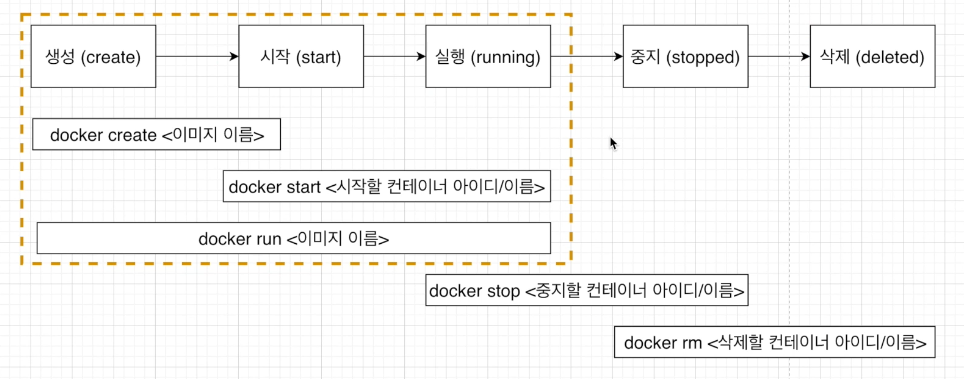
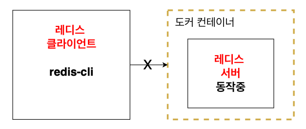

# 2. 기본적인 도커 클라이언트 명령어 알아보기

## 2.1 도커 이미지 내부 파일 구조 보기

이미지가 원래 가지고 있는 시작 명령어를 무시하고 {명령어}의 커멘드를 실행하게 합니다.

```
docker run {이미지이름} {명령어}
```


```
docker run alpine ls
```

```
bin
dev
etc
home
lib
media
mnt
opt
proc
root
run
sbin
srv
sys
tmp
usr
var
```


하지만 hello-world는 에러가 납니다.

```
docker run hello-world ls
```

```
docker: Error response from daemon: OCI runtime create failed: container_linux.go:380: starting container process caused: exec: "ls": executable file not found in $PATH: unknown.
```


alpine은 이미지 파일 스냅샷 안에 ls를 사용 가능하게 하는 파일이 있어서 가능하고 hello-world는 없기 때문에 불가능합니다.


## 2.2 컨테이너들 나열하기

현재 실행중인 컨테이너를 확인하는 명령어는 아래와 같습니다.

ps : process status

```
docker ps
```


컨테이너를 하나 실행시키고 해당 명령어를 실행해봅시다.

```
docker run alpine ping localhost
docker ps
```

```
CONTAINER ID   IMAGE     COMMAND            CREATED          STATUS          PORTS     NAMES
b6e3c08fc95d   alpine    "ping localhost"   12 seconds ago   Up 10 seconds             bold_napier
```

* CONTAINER ID : 컨테이너의 고유한 아이디 해쉬값으로 실제로는 더 길지만 일부만 표출합니다.
* IMAGE : 컨테이너 생성 시 사용한 도커 이미지
* COMMAND : 컨테이너 시작 시 실행될 명령어
* CREATED : 컨테이너가 생성된 시각
* STATUS : 컨테이너의 상태 
  * Up : 실행중
  * Exited : 종료
  * Pause : 일시정지

* PORTS : 컨테이너가 개방한 포트와 호스트에 연결된 포트

* NAMES : 컨테이너 고유한 이름

  컨테이너 생성 시 --name 옵션으로 이름을 설정할 수 있고, 옵션이 따로 없다면 도커 엔진이 임의로 이름을 설정

  아래 명령어로 이름 변경 가능

  ```
  docker rename {원래 이름} {바꿀 이름}
  ```

  


모든 컨테이너를 나열하는 명령어는 다음과 같습니다.

```
docker ps -a
```


## 2.3 도커 컨테이너의 생명주기




그 동안 사용했던 run 명령어는 create + start와 동일합니다.

create 명령어는 이미지에 있는 스냅샷을 컨테이너의 하드 디스크에 넣게 됩니다.

```
docker create hello-world
```

```
bf19523e80e2200f0db958b2a487811d36241b34d690904c611d26f39d23b531
```


start 명령어는 시작 시 실행될 명령어가 컨테이너에서 수행이 됩니다.

이 때 아이디의 일부만 입력해도 괜찮습니다.

-a 옵션은 attach의 줄임말로 실행 결과를 화면에 표출해주는 역할을 합니다.

```
docker start -a bf19523e
```


## 2.4 Docker Stop vs Docker Kill

Stop과 Kill 모두 컨테이너를 중지시키는 역할을 합니다.

Stop은 Gracefully하게, 즉 그동안 하던 작업들을 완료하고 컨테이너를 중지시키고,

Kill은 어떠한 것도 기다리지 않고 바로 컨테이너를 중지시킵니다.


## 2.5 컨테이너 삭제하기

컨테이너를 삭제하는 명령어는 아래와 같습니다.

```
docker rm {아이디 or 이름}
```


실행중인 컨테이너는 중지한 후에 삭제가 가능합니다.


모든 컨테이너를 삭제하는 명령어는 아래와 같습니다.

```
docker rm `docker ps -a -q`
```


이미지를 삭제하는 명령어는 아래와 같습니다.

```
docker rmi {이미지ID}
```


한 번에 컨테이너, 이미지, 네트워크 모두 삭제하는 명령어는 아래와 같습니다.

```
docker system prune
```

하지만 실행중인 컨테이너에는 영향을 주지 않습니다.


## 2.6 실행중인 컨테이너에 명령어 전달

이미 실행중인 컨테이너 명령어를 전달하는 명령어는 아래와 같습니다.

```
docker exec {컨테이너ID}
```


## 2.7 레디스를 이용한 컨테이너 이해

우선 redis 서버를 도커를 이용해 실행시킵니다.

```
docker run redis
```


그 후 redis 클라이언트로 연결을 시도하지만 connection이 실패합니다.

```
redis-cli
```

```
Could not connect to Redis at 127.0.0.1:6379: Connection refused
```


그 이유는 아래 그림과 같이 redis 클라이언트는 컨테이너 바깥에 있기 때문입니다.




같은 컨테이너 내에서 명령어를 수행하기 위해서는 exec을 사용해야 합니다.

```
docker exec -it 574f37ce973d redis-cli
```

```
127.0.0.1:6379>
```


`-it`옵션을 사용함으로서 명령어를 실행 한 후 계속 명령어를 적을 수 있습니다.

i는 interactive를 t는 terminal을 의미합니다.

만약 `-it` 옵션이 없다면 클라이언트를 키기만 하고 바로 나와버립니다.


## 2.8 실행 중인 컨테이너에서 터미널 생활 즐기기

실행중인 컨테이너에 명령어를 전달할 때는 아래와 같은 명령어를 사용했습니다.

```
docker exec -it {컨테이너ID} {명령어}
```


번거롭게 해당 명령어를 계속 입력하기 보다 컨테이너 안에 쉘이나 터미널 환경으로 접속할 수 있습니다.

```
docker exec -it {컨테이너ID} sh
```

물론 sh가 아닌 쉘 명령어 bash, zsh도 지원하는 환경이라면 사용가능합니다.


터미널 환경에서 나오기 위해서는 `control + D` 를 사용합니다.