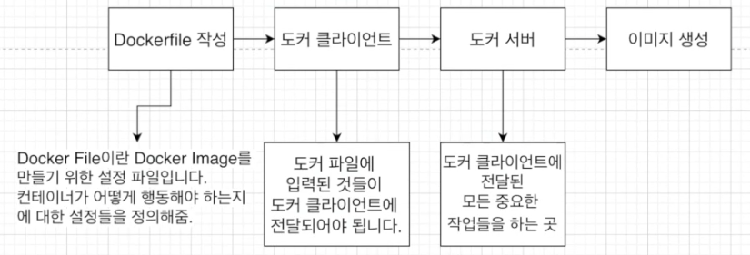
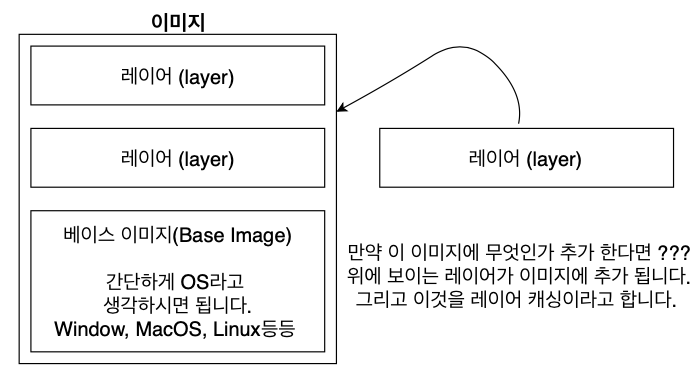

# 4. 직접 도커 이미지를 만들어 보기

## 4.1 도커 이미지 생성하는 순서

현재까지는 도커 이미지를 도커 허브에 있는 것만 가져와서 사용했습니다.

이번에는 직접 이미지를 만들어보도록 합시다.


도커 이미지를 생성하는 순서는 아래와 같습니다.




## 4.2 Docker file 만들기

### Docker file이란

도커 이미지를 만들기 위한 설정 파일이며, 컨테이너가 어떻게 행동해야 하는지에 대한 설정들을 정의해 주는 곳 입니다.


### Docker file 만드는 순서

1. 베이스 이미지를 명시해줍니다. (파일 스냅샷에 해당)
2. 추가적으로 필요한 파일을 다운 받기 위한 몇 가지 명령어를 명시해줍니다. (파일 스냅샷에 해당)
3. 컨테이너 시작 시 실행 될 명령어를 명시해줍니다. (시작 시 실행될 명령어에 해당)


### 베이스 이미지란

도커 이미지는 여러 개의 레이어로 되어 있습니다.

그 중에서 베이스 이미지는 이 이미지의 기반이 되는 부분입니다.




### 직접 만들어보기

"hello" 를 출력하는 간단한 이미지를 만들어봅시다.

1. dockerfile 생성

   ```dockerfile
   FROM baseImage
   
   RUN command
   
   CMD [ "executable" ]
   ```

   해당 명령어들은 도커 서버에서 무엇을 하라고 알려주는 역할을 합니다.

   * FROM : 이미지 생성 시 기반이 되는 이미지 레이어입니다. {이미지이름}:{태그} 형식으로 작성합니다. 태그를 붙이지 않으면 가장 최신 것을 받습니다.
   * RUN : 도커이미지가 생성되기 전에 수행할 쉘 명령어
   * CMD : 컨테이너가 시작되었을 때 실행할 실행 파일 또는 셀 스크립트입니다. 해당 명령어는 Dockerfile내 1회만 사용할 수 있습니다.

2. dockerfile 작성

   ```dockerfile
   FROM alpine
   
   CMD [ "echo", "hello" ]
   ```

   이제 각각에 실제 값들을 추가해줍니다.

   * FROM : 베이스 이미지는 ubuntu나 centos 등을 사용해도 되지만 단순히 "hello"를 출력하기 위해서는 큰 베이스 이미지를 쓸 필요가 없기에 사이즈가 작은 alpine 베이스 이미지를 사용
   * RUN : "hello"를 출력하는데 echo 명령어를 사용해야 하는데 alpine안에 echo를 사용할 수 있게 해주는 파일이 있기 에 RUN 부분은 생략합니다.
   * 컨테이너 시작 시 실행될 명령어, "hello"를 출력하는 명령어를 적어줍니다.


## 4.3 도커 파일로 도커 이미지 만들기


## 4.4 내가 만든 이미지 기억하기 쉬운 이름 주기