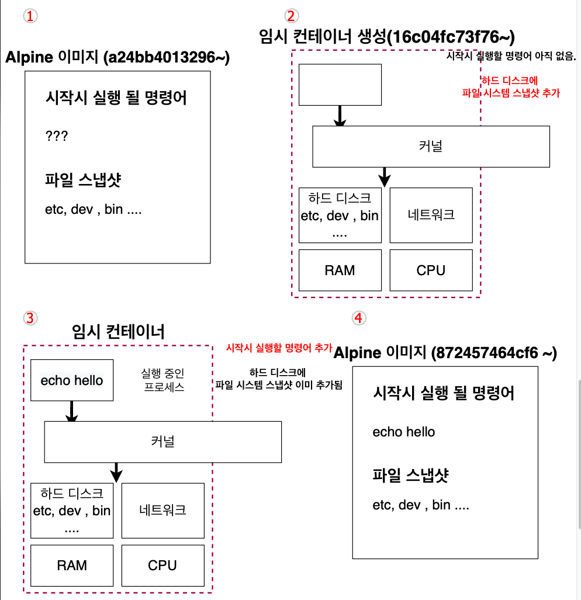
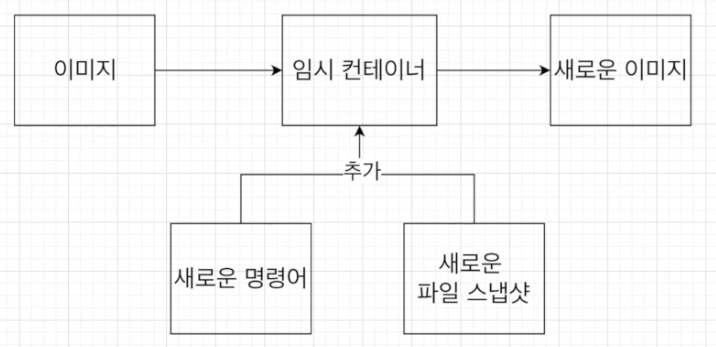

# 4. 직접 도커 이미지를 만들어 보기

## 4.1 도커 이미지 생성하는 순서

현재까지는 도커 이미지를 도커 허브에 있는 것만 가져와서 사용했습니다.

이번에는 직접 이미지를 만들어보도록 합시다.


도커 이미지를 생성하는 순서는 아래와 같습니다.


## 4.2 Docker file 만들기

### Docker file이란

도커 이미지를 만들기 위한 설정 파일이며, 컨테이너가 어떻게 행동해야 하는지에 대한 설정들을 정의해 주는 곳 입니다.


### Docker file 만드는 순서

1. 베이스 이미지를 명시해줍니다. (파일 스냅샷에 해당)
2. 추가적으로 필요한 파일을 다운 받기 위한 몇 가지 명령어를 명시해줍니다. (파일 스냅샷에 해당)
3. 컨테이너 시작 시 실행 될 명령어를 명시해줍니다. (시작 시 실행될 명령어에 해당)


### 베이스 이미지란

도커 이미지는 여러 개의 레이어로 되어 있습니다.

그 중에서 베이스 이미지는 이 이미지의 기반이 되는 부분입니다.


### 직접 만들어보기

"hello" 를 출력하는 간단한 이미지를 만들어봅시다.

1. dockerfile 생성

   ```dockerfile
   FROM baseImage
   
   RUN command
   
   CMD [ "executable" ]
   ```

   해당 명령어들은 도커 서버에서 무엇을 하라고 알려주는 역할을 합니다.

   * FROM : 이미지 생성 시 기반이 되는 이미지 레이어입니다. {이미지이름}:{태그} 형식으로 작성합니다. 태그를 붙이지 않으면 가장 최신 것을 받습니다.
   * RUN : 도커이미지가 생성되기 전에 수행할 쉘 명령어
   * CMD : 컨테이너가 시작되었을 때 실행할 실행 파일 또는 셀 스크립트입니다. 해당 명령어는 Dockerfile내 1회만 사용할 수 있습니다.

2. dockerfile 작성

   ```dockerfile
   FROM alpine
   
   CMD [ "echo", "hello" ]
   ```

   이제 각각에 실제 값들을 추가해줍니다.

   * FROM : 베이스 이미지는 ubuntu나 centos 등을 사용해도 되지만 단순히 "hello"를 출력하기 위해서는 큰 베이스 이미지를 쓸 필요가 없기에 사이즈가 작은 alpine 베이스 이미지를 사용
   * RUN : "hello"를 출력하는데 echo 명령어를 사용해야 하는데 alpine안에 echo를 사용할 수 있게 해주는 파일이 있기 에 RUN 부분은 생략합니다.
   * 컨테이너 시작 시 실행될 명령어, "hello"를 출력하는 명령어를 적어줍니다.


## 4.3 도커 파일로 도커 이미지 만들기

위에서 작성한 도커 파일을 도커 클라이언트에 전달하여 도커 서버가 인식하게 하여야합니다.

해당 명령어는 아래와 같습니다.

```shell
docker build .
```

이 명령어를 통해 해당 디렉토리 내에 dockerfile 파일을 찾아 도커 클라이언트에 전달합니다.

명령어 실행 시 내부적으로는 아래와 같이 동작합니다.



1. FROM에 있는 베이스 이미지 가져오기
2. 베이스 이미지를 통해 임시 컨테이너 생성하여 파일 스냅샷 추가
3. 시작 시 실행할 명령어 추가
4. 임시 컨테이너를 통해 새로운 이미지 생성 후 임시 컨테이너는 삭제


베이스 이미지에서 다른 종속성이나 새로운 커맨드를 추가 할 때는 임시 컨테이너를 만든 후 그 컨테이너를 토대로 새로운 이미지를 만듭니다. 

그리고 그 임시 컨테이너는 지워줍니다.




## 4.4 내가 만든 이미지 기억하기 쉬운 이름 주기

위에서 만들었던 Dockerfile을 build 해봅시다.

```
docker build .                                     
```

```
[+] Building 0.3s (5/5) FINISHED                                                                                                            
 => [internal] load build definition from Dockerfile                                                                                   0.1s
 => => transferring dockerfile: 80B                                                                                                    0.0s
 => [internal] load .dockerignore                                                                                                      0.0s
 => => transferring context: 2B                                                                                                        0.0s
 => [internal] load metadata for docker.io/library/alpine:latest                                                                       0.0s
 => [1/1] FROM docker.io/library/alpine                                                                                                0.0s
 => exporting to image                                                                                                                 0.0s
 => => exporting layers                                                                                                                0.0s
 => => writing image sha256:4fa59e3cf32a07c8dfa1d8cc1805e75e33f8c9f096a66d3a40ecc4ed2e411592                                           0.0s
```


생성된 도커ID를 통해 실행할 수 있습니다.

```
docker run -it 4fa59e3cf32a07c8dfa1d8cc1805e75e33f8c9f096a66d3a40ecc4ed2e411592                  
```

```
hello
```


하지만 복잡한 ID 값은 기억하기가 어렵습니다.

따라서 build 시, 이름을 붙여줄 수 있습니다.

```
docker build -t {도커아이디}/{저장소 or 프로젝트 이름}:{버전}
```


예를 들어 아래와 같이 이름을 붙여줄 수 있습니다.

```
docker build -t rkdalstjd9/hello:latest . 
```


그 결과 이름으로 실행이 가능합니다.

```
docker run -it rkdalstjd9/hello                                                
```

```
hello
```

