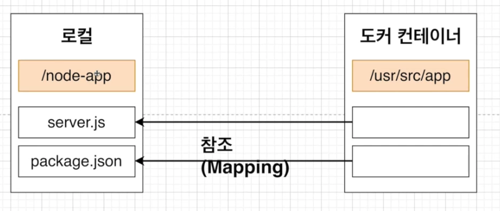

# 5. 도커를 이용한 간단한 Node.js 어플 만들기

## 5.1 섹션 설명

Node.js 공식 홈페이지에서 도커를 이용하는 예시를 통해 도커를 학습합니다.

Dockerfile을 어떻게 작성하는지를 중점적으로 다룹니다.


## 5.2 Node.js 앱 만들기

Node.js에 대해서는 최소한만 학습합니다.

package.json : 프로젝트의 정보와 프로젝트에서 사용 중인 패키지의 의존성을 관리하는 곳

server.js : 가장 먼저 시작되는 파일


아래 명령어로 package.json을 쉽게 생성할 수 있습니다.

```
npm init
```

```
 This utility will walk you through creating a package.json file.
It only covers the most common items, and tries to guess sensible defaults.

See `npm help json` for definitive documentation on these fields
and exactly what they do.

Use `npm install <pkg>` afterwards to install a package and
save it as a dependency in the package.json file.

Press ^C at any time to quit.
package name: (nodejs-docker-app) 
version: (1.0.0) 
description: 
entry point: (index.js) server.js
test command: 
git repository: 
keywords: 
author: 
license: (ISC) 
About to write to /Users/rkdalstjd9/Desktop/DOCKER_STUDY/Minsung/section05/nodejs-docker-app/package.json:

{
  "name": "nodejs-docker-app",
  "version": "1.0.0",
  "description": "",
  "main": "server.js",
  "scripts": {
    "test": "echo \"Error: no test specified\" && exit 1"
  },
  "author": "",
  "license": "ISC"
}


Is this OK? (yes) yes
```


완성된 package.json에 몇 가지를 추가해줍니다.

```json
{
  "name": "nodejs-docker-app",
  "version": "1.0.0",
  "description": "",
  "main": "server.js",
  "scripts": {
    "test": "echo \"Error: no test specified\" && exit 1",
    "start": "node server.js"
  },
  "dependencies": {
    "express": "4.17.1"
  },
  "author": "",
  "license": "ISC"
}
```

express : Node.js의 API를 단순화하고 새로운 기능을 추가해서 Node.js를 더쉽고 유용하게 사용할 수 있게 해줍니다.


다음으로는 server.js를 생성해줍니다.

```js
const express = require('express');

const PORT = 8080;

const app = express();
app.get('/', (req, res) => {
    res.send("Hello World")
});

app.listen(PORT);

console.log("Server is running");
```


## 5.3 Dockerfile 작성하기

위에서 만든 Nodejs 앱을 도커 환경에서 실행하려면 먼저 이미지를 생성하고 그 이미지를 이용해서 컨테이너를 실행한 후 그 컨테이너 안에서 Nodejs 앱을 실행해야 합니다.

그 이미지를 생성하려면 Dockerfile을 먼저 작성해야 합니다.

```dockerfile
FROM node:10

RUN npm install

CMD ["node", "server.js"]
```

* FROM : 기존에 사용하던 alpine 베이스 이미지에는 npm 명령어가 존재하지 않습니다.
  따라서 node 베이스 이미지를 사용하였습니다.
* RUN : npm install을 통해서 package.json내 dependencies에 있는 종속성들을 다운받아 설치해줍니다.
* CMD : node server.js는 노드 웹서버를 작동시키는 명령어입니다.


## 5.4 Package.json 파일이 없다고 나오는 이유

위에서 만든 Dockerfile을 build하면 에러가 발생합니다.

에러는 Package.json을 찾지 못하는 에러입니다.

bulid 시 베이스 이미지의 파일 스냅샷은 컨테이너 안으로 들어가지만 package.json과 server.js은 컨테이너 안에 없습니다.

따라서 COPY 명령어를 통해 파일들을 컨테이너 안으로 넣어줍니다.

```dockerfile
COPY {복사할 파일 경로} {컨테이너 내 복사될 경로}
```


즉 Dockerfile은 아래와 같이 바뀝니다.

```Dockerfile
FROM node:10

COPY . .

RUN npm install

CMD ["node", "server.js"]
```


이제 다시 build 후 실행 시켜보겠습니다.

```
docker build -t rkdalstjd9/nodejs .
docker run -it rkdalstjd9/nodejs  
```

```
Server is running
```


성공적으로 서버가 돌아가고 있지만 해당 8080 포트로 접속해도 정상적으로 접속이 되지 않습니다.


## 5.5 생성한 이미지로 어플리케이션 실행 시 접근이 안 되는 이유

로컬은 컨테이너 내부와 네트워크가 연결되어 있지 않기 때문에 연결을 해줘야 접속이 가능합니다.

컨테이너 실행 시 t 옵션을 통해 내부와 외부의 포트를 연결해줄 수 있습니다.

```
docker run -p {외부포트}:{컨테이너 내부 포트} {이미지이름}
```


따라서 아래와 같이 실행하면 localhost:5000으로 접속 시 성공적으로 접속되는 것을 확인할 수 있습니다.

```
docker run -p 5000:8080 rkdalstjd9/nodejs
```


## 5.6 Working Directory 명시해주기

Working Directory는 아래와 같이 명시해줍니다.

```
WORKDIR {DIR 경로}
```


이 명령어를 통해 이미지 안에서 어플리케이션 소스 코드를 가지고 있을 디렉토리를 생성합니다.

왜 Working Directory가 따로 필요할까요?


위에서 생성한 이미지의 루트를 확인해봅시다.

```
docker run -it rkdalstjd9/nodejs sh 
ls
```

```
Dockerfile  boot  etc   lib    media  node_modules  package-lock.json  proc  run   server.js  sys  usr
bin         dev   home  lib64  mnt    opt           package.json       root  sbin  srv        tmp  var
```


기존 node:10의 구성과 COPY를 통해 복사한 구성이 같은 경로에 있어 구분하기가 쉽지 않습니다.

뿐만 아니라 중복되는 폴더가 있으면 덮어씌어지는 문제가 생깁니다.


아래와 같이 dockerfile을 수정하고 다시 build 해줍니다.

```dockerfile
FROM node:10

WORKDIR /usr/src/app

COPY . .

RUN npm install

CMD ["node", "server.js"]
```


다시 루트를 확인해봅시다.

이제 컨테이너에 접속 시 루트가 아닌 WORKDIR부터 접속됩니다.

```
Dockerfile  node_modules  package-lock.json  package.json  server.js
```


## 5.7 어플리케이션 소스 변경으로 다시 빌드하는 것에 대한 문제점

어플리케이션을 만들다보면 소스코드를 계속 변경시켜줘야 하며 그에 따라서 변경된 부분을 확인하면서 개발을 해야합니다.

도커를 이용하여 어떻게 실시간으로 소스가 반영되게 하는지 알아봅시다.


현재까지는 build하고 다시 실행해야 하는 번거로움이 있었습니다.

번거로울 뿐만 아니라 위 경우, COPY를하고 npm install로 종속성들까지 다운을 받게 됩니다.


## 5.8 어플리케이션 소스 변경으로 재빌드 시 효율적으로 하는 법

npm install도 기본적으로 cache 전략을 취합니다.

이미 받은 이력이 있으면 cache에서 이를 받아오게 되는데 만일 수정된 파일이 있다면 다시 install을 합니다.

따라서 현재 dockerfile의 COPY를 아래와 같이 두 개로 나눈다면 어떻게 될까요?

```dockerfile
FROM node:10

WORKDIR /usr/src/app

COPY pacakge.json .

RUN npm install

COPY . .

CMD ["node", "server.js"]
```


pacakge.json이 바뀌었을 때, 즉 정말로 종속성을 새롭게 install 해야할 때만 하고 나머지는 cache 전략을 취할 수 있습니다.


## 5.9 Docker Volume에 대하여

기존에는 변경된 소스가 있을 때 COPY 한 후 이미지를 다시 빌드를 해주고 컨테이너를 실행해야 반영되었습니다.

이러한 작업은 시간 소요가 크며 이미지도 너무나 많이 빌드하게 됩니다.

이러한 문제를 해결하기 위해 Volume을 사용합니다.


Volume은 COPY가 아닌 Mapping입니다.

도커 컨테이너 안에서 로컬의 파일을 참조하는 방식입니다.




Volume을 사용해서 어플리케이션을 실행하는 명령어는 아래와 같습니다.

```
docker run -p 5000:8000 -v /usr/src/app/node_modules -v $(pwd):/usr/src/app {이미지}
```

* -v /usr/src/app/node_modules : 로컬에는 node_modules이 없기에 컨테이너에서 Mapping하지 않도록 함
* -v $(pwd):/usr/src/app : /usr/src/app 경로에서 $(pwd), 현재 경로를 참조함


이제는 새롭게 build할 필요없이 stop하고 다시 run 해주면 수정사항이 변경되는 것을 확인할 수 있습니다.