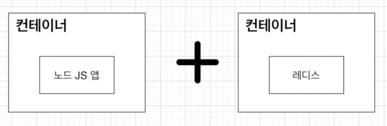
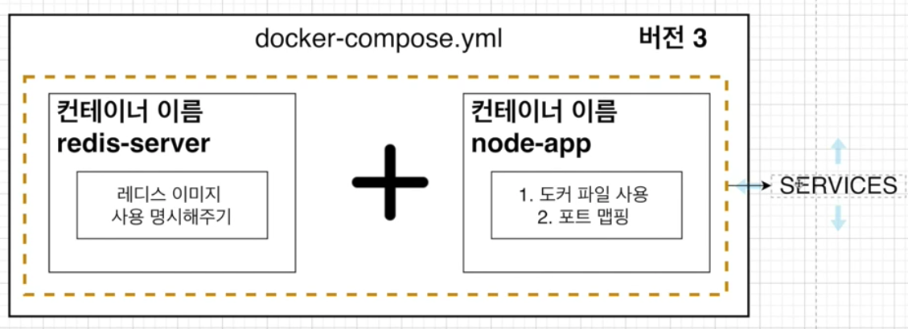

# 6. Docker Compose

## 6.1 Docker Compose란 무엇인가?

docker compose는 다중 컨테이너 도커 애플리케이션을 정의하고 실행하기 위한 도구입니다.

페이지를 새로고침할 때마다 숫자가 1씩 올라가는 애플리케이션을 만들어보며 docker compose를 학습합니다.




## 6.2 어플리케이션 소스 작성하기

package.json의 코드입니다.

```json
{
  "name": "docker-compose-app",
  "version": "1.0.0",
  "description": "",
  "main": "server.js",
  "scripts": {
    "start": "node server.js",
    "test": "echo \"Error: no test specified\" && exit 1"
  },
  "dependencies": {
    "express": "4.17.1",
    "redis": "3.0.2"
  },
  "author": "",
  "license": "ISC"
}
```


server.js의 코드입니다.

```js
const express = require("express");
const redis = require("redis");

const client = redis.createClient({
    host: "redis-server",
    port: 6379
})

const app = express();

client.set("number", 0);

app.get('/', (req, res) => {
    client.get("number", (err, number) => {
        client.set("number", parseInt(number) + 1);
        res.send("숫자가 1씩 올라갑니다. 숫자: " + number);
    })
})
app.listen(8080);

console.log("Server is running");
```

도커를 사용하지 않는 환경에서는 redis 서버의 host를 URL로 주면 되지만 도커 Compose를 사용할 때는 host 옵션을 docker-compose.yml 파일에 명시한 컨테이너 이름으로 주면 됩니다.


## 6.3 Dockerfile 작성하기

Dockerfile은 저번 강의에서 작성했던 것과 동일합니다.

```dockerfile
FROM node:10

WORKDIR /usr/src/app

COPY . .

RUN npm install

CMD ["node", "server.js"]
```


## 6.4 Docker Containers간 통신 할 때 나타나는 에러

레디스 클라이언트가 실행되기 위해서는 레디스 서버가 먼저 실행되고 있어야 합니다.

따라서 레디스 서버를 위한 컨테이너를 먼저 실행해야 합니다.


우선 redis 서버를 실행해줍시다.

```
docker run redis
```


그 후에 위에서 생성한 이미지를 빌드해주고 실행해줍니다.

```
docker build -t rkdalstjd9/docker-compose-app .
```

```
docker run rkdalstjd9/docker-compose-app
```


그 결과 연결을 하지 못하는 에러가 발생했습니다.

```
Server is running
events.js:174
      throw er; // Unhandled 'error' event
      ^

Error: Redis connection to redis-server:6379 failed - getaddrinfo ENOTFOUND redis-server redis-server:6379
    at GetAddrInfoReqWrap.onlookup [as oncomplete] (dns.js:56:26)
Emitted 'error' event at:
    at RedisClient.on_error (/usr/src/app/node_modules/redis/index.js:341:14)
    at Socket.<anonymous> (/usr/src/app/node_modules/redis/index.js:222:14)
    at Socket.emit (events.js:198:13)
    at emitErrorNT (internal/streams/destroy.js:91:8)
    at emitErrorAndCloseNT (internal/streams/destroy.js:59:3)
    at process._tickCallback (internal/process/next_tick.js:63:19)
```


서로 다른 컨테이너 사이에는 아무런 설정 없이는 접근을 할 수 없기에 노드 JS 앱에서 레디스 서버에 접근을 할 수 없습니다.

멀티 컨테이너 상황에서 쉽게 네트워크를 연결 시켜주기 위해서 Docker Compose를 이용하면 됩니다.


## 6.5 Docker Compose 파일 작성하기

이번에 만들 docker compose의 구조는 아래와 같습니다.




docker-compose.yml 파일을 작성해줍니다.

```yaml
version: "3"
services:
  redis-server:
    image: "redis"
  node-app:
    build: .
    ports:
      - "5000:8080"
```

* version: docker compose의 버전
* services : 이곳에 실행하려는 컨테이너들을 명시
  * redis-server : 컨테이너 이름
    * image : 컨테이너에서 사용하는 이미지
  * node-app : 컨테이너 이름
    * build : 현 디렉토리에 있는 Dockerfile을 사용
    * ports : 로컬포트:컨테이너포트 mapping


이제 아래 명령어로 docker compose를 실행하면 localhost:5000으로 정상 접속됩니다.

```
docker-compose up
```


## 6.6 Docker Compose로 컨테이너를 멈추기

docker-compose를 통해 작동시킨 컨테이너들을 한꺼번에 중단시키려면 아래 명령어로 할 수 있습니다.

```
docker compose down
```


docker-compose up : 이미지가 없을 때 이미지를 빌드하고 컨테이너 시작

docker-compose up --build : 이미지가 있든 없든 이미지를 빌드하고 컨테이너 시작

docker-compose up -d : detached 모드로서 앱을 백그라운드에서 실행