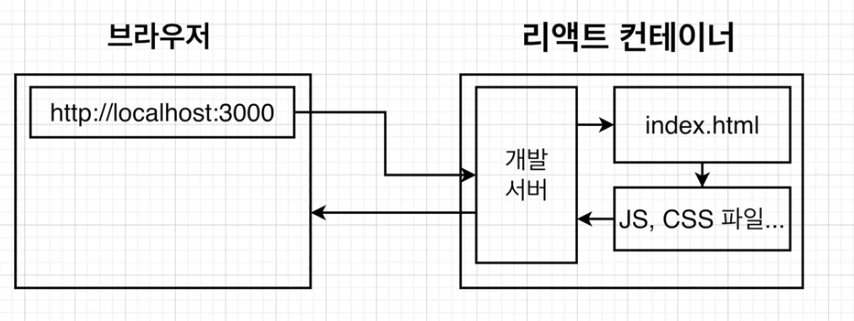
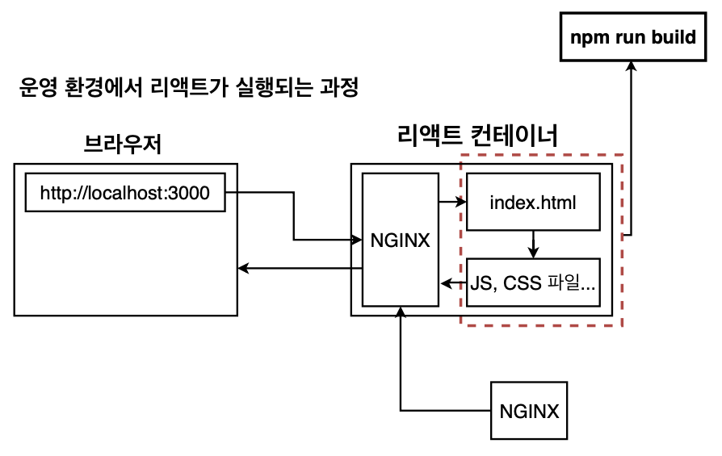
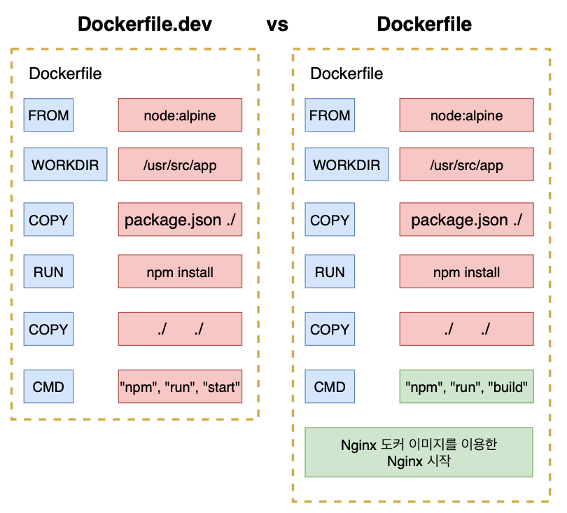

# 7. 간단한 어플을 실제로 배포해보기(개발 환경 부분)

## 섹션 설명

section6, 7에 걸쳐 단일 컨테이너 환경의 리액트 앱을 만듭니다.


## 리액트 앱 설치하기

먼저 노드 버전을 확인합니다.

없다면 공식 웹사이트에서 다운을 받아줍니다.

```
node -v
# v12.14.1
```


docker-react-app이라는 폴더를 만들고 해당 폴더 내에서 리액트 앱을 생성합니다.

```
npx create-react-app .   
```

* react 앱 실행 : npm run start
* react 앱 테스트 : npm run test
* react 앱 배포 : npm run build


## 도커를 이용하여 리액트 앱 실행하기

도커를 이용해서 리엑트 앱을 실행하기 위해서는 아래와 같은 순서로 진행합니다.

도커 이미지 생성 -> 이미지를 이용해서 컨테이너 만들기 -> 컨테이너 안에서 앱을 실행하기


도커 이미지를 생성하기 위한 Dockerfile을 두 가지 버전으로 만들겠습니다.

Dockerfile : 운영 환경

Dockerfile.dev : 개발 환경


개발환경에서의 Dockerfile.dev는 현재까지 작성했던 도커 파일과 유사합니다.

```dockerfile
FROM node:alpine

WORKDIR /usr/src/app

COPY package.json .

RUN npm install

COPY . .

CMD ["npm", "run", "start"]
```


그 후 build를 하면 에러가 발생합니다.

```
docker build .                                 
```

```
unable to prepare context: unable to evaluate symlinks in Dockerfile path: lstat /Users/rkdalstjd9/Desktop/DOCKER_STUDY/Minsung/section07/docker-react-app/Dockerfile: no such file or directory
```


기본적으로 Dockerfile의 이름을 가진 파일을 읽기 때문에 파일명을 바꿨으면 파일명을 지정해줘야 합니다.

```
docker build -f Dockerfile.dev .
```


node_modules에는 리액트 앱을 실행할 때 필요한 모듈들이 들어있지만 이미지를 빌드할 때 이미 npm install로 모든 모듈들을 도커 이미지에 다운 받기 때문에 굳이 로컬 머신에 node_modules을 필요로 하지 않습니다.

그러기에 로컬에서는 node_modules를 지워주면 좋습니다.


## 생성된 도커 이미지로 리액트 앱 실행해보기

저번에 생성한 이미지는 이름을 안줬기 때문에 이름을 추가해서 새롭게 빌드합니다.

```
docker build -f Dockerfile.dev -t rkdalstjd9/docker-react-app .
```


포트 번호를 3000으로 맞춰줘서 실행시켜주면 접속이 되는 것을 확인할 수 있습니다.

```
docker run -it -p 3000:3000 rkdalstjd9/docker-react-app
```


## 도커 볼륨을 이용한 소스 코드 변경

이번에는 Volume을 사용하여 소스를 변경했을 때 다시 빌드하지 않아도 변경한 소스 부분이 어플리케이션에 반영되도록 해보겠습니다.

```
docker run -p 3000:3000 -v /usr/src/app/node_modules -v $(pwd):/usr/src/app rkdalstjd9/docker-react-app
```


## 도커 컴포즈로 좀 더 간단하게 앱 실행해보기

Volume을 이용한 방식도 명령어가 너무 길기 때문에 불편합니다.

docker compose를 이용하여 더 쉽게 작성해봅시다.

```yml
version: "3"
services:
  react:
    build:
      context: .
      dockerfile: Dockerfile.dev
    ports:
      - "3000:3000"
    volumes:
      - /usr/src/app/node_modules
      - ./:/usr/src/app
    stdin_open: true
```

context : 도커 이미지를 구성하기 위한 파일과 폴더들이 있는 위치

dockerfile : 도커 파일 어떤 것인지 지정


아래 명령어로 실행 시, 수정사항이 바로 반영되는 것을 확인할 수 있습니다.

```
docker-compose up
```


## 리액트 앱 테스트 하기

현재 로컬에서는 node_modules를 지웠기 때문에 테스트 명령어가 수행되지 않습니다.

```
npm run test
```


docker 내에서 테스트 시 성공하는 것을 확인할 수 있습니다.

```
docker run -it rkdalstjd9/docker-react-app npm run test
```

```
src/App.test.js
  ✓ renders learn react link (53 ms)

Test Suites: 1 passed, 1 total
Tests:       1 passed, 1 total
Snapshots:   0 total
Time:        3.751 s
Ran all test suites.
```


하지만 이 경우 새로운 테스트가 생겨도 바로 반영이 되지않습니다.

여태까지와 마찬가지로 이를 위해서 Volume을 이용합니다.

docker compose를 통해 해결해봅시다.

```yml
version: "3"
services:
  react:
    build:
      context: .
      dockerfile: Dockerfile.dev
    ports:
      - "3000:3000"
    volumes:
      - /usr/src/app/node_modules
      - ./:/usr/src/app
    stdin_open: true
  tests:
    build:
      context: .
      dockerfile: Dockerfile.dev
    volumes:
      - /usr/src/app/node_modules
      - ./:/usr/src/app
    command: ["npm", "run", "test"]
```


이렇게 되면 앱을 시작할 때 두 개의 컨테이너를 다 시작하게 되니, 먼저 리액트 앱을 실행하고 테스트도 실행하게 됩니다.

아래 명령어로 실행시키면 테스트 코드도 바로 반영되는 것을 확인할 수 있습니다.

```
docker-compose up --build
```


## 운영환경을 위한 Nginx

Nginx가 왜 필요한지 알아봅시다.

개발 환경에서 리액트가 실행되는 과정은 아래와 같습니다.




운영 환경에서는 아래와 같습니다.



운영 환경에서의 정적파일(html, js, css) 등은 `npm run build` 명령어를 통해 생성된 build 폴더 안에 파일들을 말합니다.


### 개발환경 서버와 운영환경 서버는 다른 것을 써야하나?

개발에서 사용하는 서버는 소스를 변경하면 자동으로 전체 앱을 다시 빌드해서 변경 소스를 반영해주는 것 같이 개발 환경에 특화된 기능들이 있습니다.

이는 nginx 서버보다 개발환경에 더 적합합니다.

운영환경에서는 소스를 변경할 때 다시 반영해줄 필요가 없으며 개발에 필요한 기능들이 필요하지 않기에 더 깔끔하고 빠른 Nginx를 웹서버로 사용합니다.


## 운영환경 도커 이미지를 위한 Dockerfile 작성하기

개발환경과 운영환경의 Dockerfile이 어떤 차이가 있는지 확인해봅시다.

운영환경을 위한 Dockerfile은 크게 두 가지로 나누어져 있습니다.

빌드 파일을 생성하는 부분과 Nginx를 가동하는 부분입니다.




이에 맞춰 dockerfile을 작성해줍시다.

```dockerfile
FROM node:alpine as builder
WORKDIR '/usr/src/app'
COPY package.json .
RUN npm install 
COPY ./ ./
RUN npm run build

FROM nginx
COPY --from=builder /usr/src/app/build /usr/share/nginx/html
```

--from=builder : 다른 stage에 있는 파일을 복사할 대 다른 Stage 이름을 명시

/usr/src/app/build /usr/share/nginx/html : build 폴더에 있는 파일을 nginx 쪽으로 옮겨 클라이언트의 요청이 올 때 정적파일들을 제공해줄 수 있게 함. 


그 후 빌드 후 실행시켜줍시다.

```
docker build -t rkdalstjd9/docker-react-app .
```

```
docker run -p 8080:80 rkdalstjd9/docker-react-app  
```

