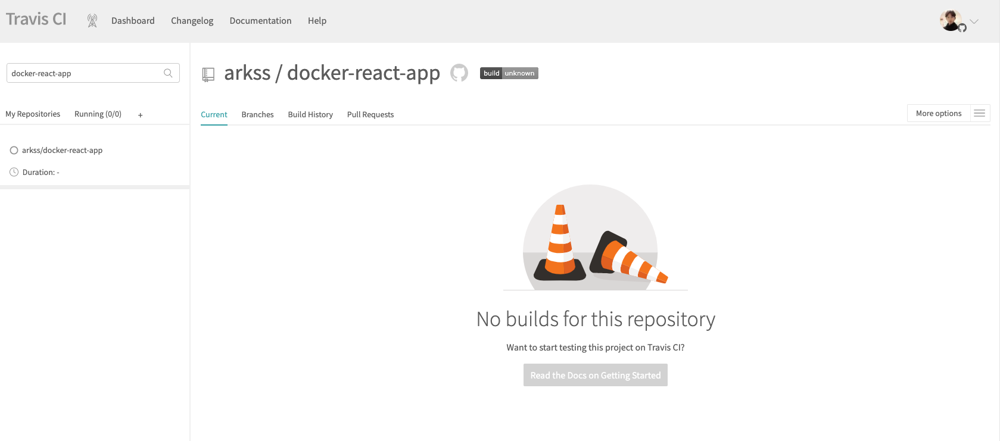
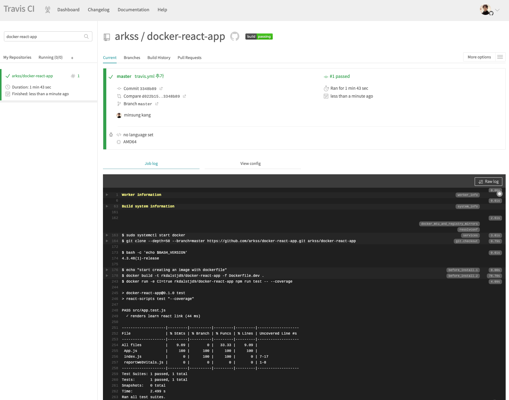
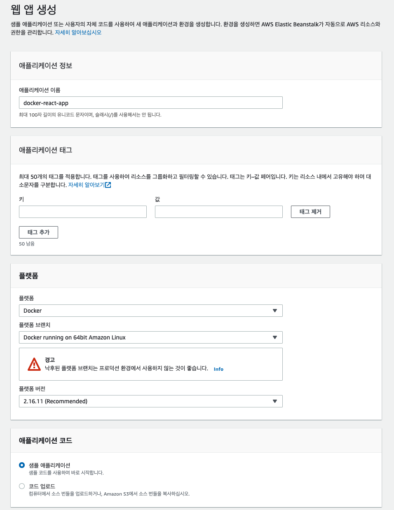
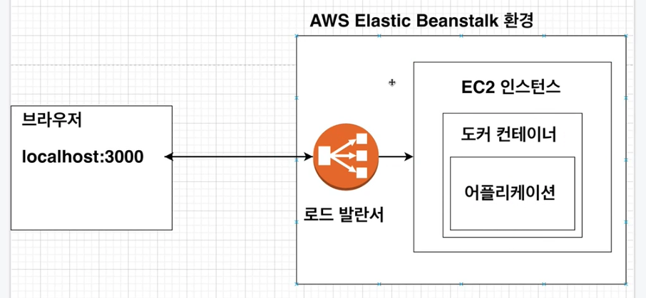

# 8. 간단한 어플을 실제로 배포해보기(테스트&배포 부분)

## 섹션 설명 & Github에 소스 코드 올리기

section07에서 생성한 소스코드를 Github에 배포한 후 Travis CI에서 소스를 가져간 후 소스 코드와 잘 돌아가는지 Test를 한 후 성공하면 AWS에 보내 배포하는 과정을 학습합니다.

기존의 docker-react-app을 github에 push해줍니다.


## Travis CI 설명

**Travis CI** 는 Github에서 진행되는 오픈소스 프로젝트를 위한 지속적인 통합 서비스입니다.

Travis CI를 이용하면 Github repository에 있는 프로젝트를 특정 이벤트에 따라 자동으로 테스트, 빌드하거나 배포할 수 있습니다.

Private repository는 유료로 일정 금액을 지불하고 사용할 수 있습니다.


Travis CI의 흐름은 아래와 같습니다.

로컬 Git -> Github -> Travis CI -> AWS


## Travis CI 이용 순서

https://app.travis-ci.com/

github 계정을 통해 회원가입 및 로그인을 진행합니다.

위에서 만든 repo를 등록시킵니다.




## .travis.yml 파일 작성하기 (테스트까지)

`.travis.yml` 을 작성해줍니다.

```yml
sudo: required

language: generic

services:
  - docker

before_install:
  - echo "start creating an image with dockerfile"
  - docker build -t rkdalstjd9/docker-react-app -f Dockerfile.dev .

script:
  - docker run -e CI=true rkdalstjd9/docker-react-app npm run test -- --coverage

after_success:
  - echo "Test Success"
```

* sudo : 관리자 권한갖기
* language : 언어(플랫폼)을 선택
* services : 도커 환경 구성
* before_install : 스크립트를 실행 할 수 있는 환경(build를 미리 해놔야 이후에 run이 가능하다.)
* script : 실행할 스크립트(coverage를 통해 결과를 더 자세하게 확인할 수 있다.)
* after_success : 테스트 성공 후 할 일


해당 파일을 repo에 push하면 자동으로 CI가 동작하고 결과가 출력됩니다.

아래 표는 coverage로 인해 출력되는 부분이고, 몇 개의 테스트가 성공했는지를 확인할 수 있습니다.




## AWS 알아보기

AWS 회원가입 후 신용카드를 등록합니다.

### EC2

Elastic Compute Cloud의 줄임말로 한 대의 컴퓨터를 임대한다고 생각하면 됩니다.

### EB

Elastic BeanStalk의 줄임말로 Docker와 함께 개발된 웹 응용 프로그램 및 서비스를 배포하고 확장하기 쉬운 서비스를 말합니다.

EC2 인스턴스나 데이터베이스 같이 많은 것들을 포함한 환경을 구성하며 만들고 있는 소프트웨어를 업데이트 할 때마다 자동으로 이 환경을 관리해줍니다.


## Elastic Beanstalk 환경 구성하기

Elastic Beanstalk로 들어가서 `Create Application` 을 눌러 새로운 앱을 생성합니다.




Elastic Beanstalk를 사용하면 그 환경 안에 자동으로 아래와 같이 세팅이 됩니다.

로드 발란서가 있기 때문에 트래킹이 증가하면 자동으로 EC2 인스턴스를 새롭게 만들어줍니다.




## .travis.yml 파일 작성하기 (배포 부분)

현재까지는 도커 이미지를 생성 후 어플을 실행하여 테스트하는 부분까지 travis 설정을 하였습니다.

이젠 테스트에 성공한 소스를 AWS EB에 자동으로 배포하는 부분을 추가해봅시다.


* provider : 외부 서비스 표시(s3, eb, firebase)
* 


## Travis CI의 AWS 접근을 위한 API 생성


