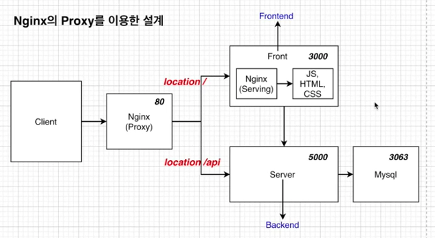
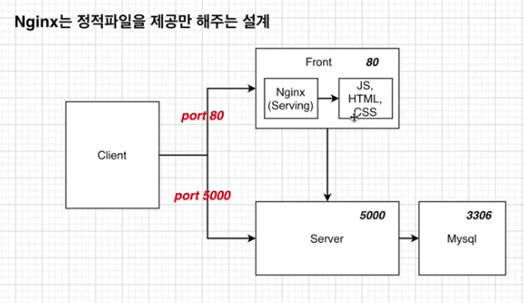
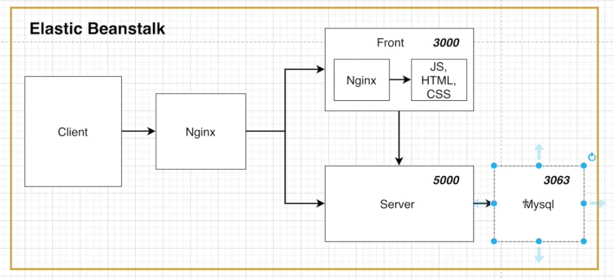
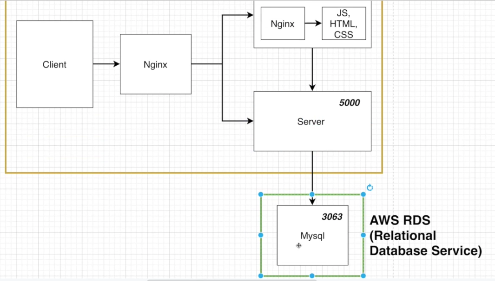
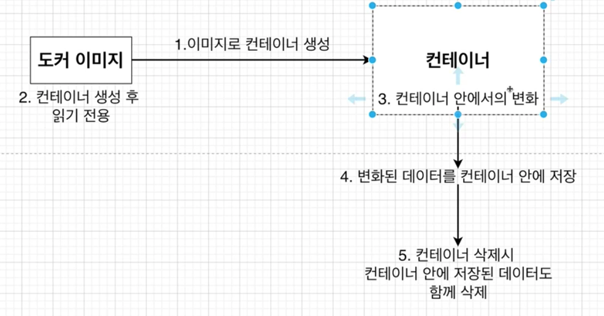

# 9. 복잡한 어플을 실제로 배포해보기(개발 환경 부분)

## 섹션 설명

좀 더 많은 컨테이너를 사용하여 좀 더 실무에서 사용할수 있는 어플리케이션을 만들어보겠습니다.


Nginx를 사용하여 설계하는 방법이 여러 가지가 있습니다.

아래 두 방법 중 더 어려운 위에 방식으로 개발하겠습니다.



### 장점

* Request를 보낼 때 URL host 이름이 바뀌어도 변경시켜주지 않아도 됩니다.
* 포트가 바뀌어도 변경을 안해주어도 됩니다.

### 단점

* nginx 설정, 전체 설계가 다소 복잡합니다.



### 장점

* 설계가 다소 간단하여 구현하는게 더 쉽습니다.

### 단점

* host name이나 포트 변경있을 때 Request URL도 변경시켜주어야 합니다.

  

## Node JS 구성하기

package.json을 생성합니다.

```
npm init
```

```json
{
  "name": "docker-fullstack-app",
  "version": "1.0.0",
  "description": "",
  "main": "server.js",
  "scripts": {
    "test": "echo \"Error: no test specified\" && exit 1",
    "start": "node server.js",
    "dev": "nodemon server.js"
  },
  "dependencies": {
    "express": "4.17.1",
    "mysql": "2.16.0",
    "nodemon": "1.18.3",
    "body-parser": "1.19.0"
  },
  "author": "",
  "license": "ISC"
}

```

nodemon : 서버 코드 수정 시 재시작할 수 있게 해주는 모듈

body-parser : 클라이언트 요청의 본문을 해석해주는 모듈


server.js 입니다.

```javascript
const express = require("express");
const bodyParser = require("body-parser");

const db = require("./db");

const app = express();

// app.use(bodyParser.json());
app.use(express.urlencoded({ extended: true }));

app.use(express.json());

db.pool.query(`CREATE TABLE lists (
    id INTEGER AUTO_INCREMENT,
    value TEXT,
    PRIMARY KEY (id)
)`, (err, results, fields) => {
    console.log('results', results)
})

app.get('/api/values', function(req, res){
    db.pool.query('SELECT * FROM lists;',
        (err, results, fields) => {
            if (err) 
                return res.status(500).send(err)
            else 
                return res.json(results)
        })
})

app.post('/api/value', function(req, res, next){
    db.pool.query(`INSERT INTO lists (value) VALUES("${req.body.value}")`,
        (err, results, fields) => {
            if (err) 
                return res.status(500).send(err)
            else 
                return res.json({ success: true, value: req.body.value })
        })
})

app.listen(5000, ()=>{
    console.log("5000 포트에서 시작")
})

```


db.js 입니다.

```json
const mysql = require("mysql");
const pool = mysql.createPool({
    connectionLimit: 10,
    host: "mysql",
    user: "root",
    password: "",
    database: "myapp"
});
exports.pool = pool;
```


## React JS 구성하기

react로 front를 작성합니다.

위에서 만든 `DOCKER-FULLSTACK-APP` 에서 아래 명령어로 react app을 만듭니다.

```
npx create-react-app frontend
```


App.js를 아래와 같이 수정해줍니다.

``` react
import React, {useState, useEffect} from 'react';
import logo from './logo.svg';
import './App.css';
import axios from 'axios';

function App() {

  useEffect(() => {
    axios.get('/api/values')
    .then(response => {
      console.log('response', response)
      setLists(response.data)
    })
  }, [input])

  const [lists, setLists] = useState([])
  const [value, setValue] = useState("")

  const changeHandler = (event) => {
    setValue(event.currentTarget.value)
  }

  const submitHandler = (event) => {
    event.preventDefault();

    axios.post('/api/value', {value: value})
    .then(response => {
      if (response.data.success) {
        console.log('response', response)
        setLists([...lists, response.data])
        setValue("")
      } else {
        alert('값을 DB에 넣는데 실패했습니다.')
      }
    })
  }

  return (
    <div className="App">
      <header className="App-header">
        
        <div className="container">
          {list && list.map((list, index) => (
            <li key={index}>{list.value}</li>
          ))}
          <form className="example" onSubmit={submitHandler}>
            <input
              type="text"
              placeholder="입력해주세요..."
              onChange={changeHandler}
              value={value}
            />
            <button type="submit">확인</button>
          </form>
        </div>
      </header>
    </div>
  );
}

export default App;
```


axios를 사용하므로 package.json의 dependencies에 추가해줍니다.

``` json
  "dependencies": {
    "@testing-library/jest-dom": "^5.14.1",
    "@testing-library/react": "^11.2.7",
    "@testing-library/user-event": "^12.8.3",
    "react": "^17.0.2",
    "react-dom": "^17.0.2",
    "react-scripts": "4.0.3",
    "web-vitals": "^1.1.2",
    "axios": "0.19.2"
  },
```


## 리액트 앱을 위한 도커 파일 만들기

먼저 react의 도커 파일을 만들어봅시다.

frontend 폴더 안에 Dockerfile, Dockerfile.dev을 만들어줍니다.

개발환경에서 사용하는 `Dockerfile.dev` 은 아래와 같습니다.

```dockerfile
FROM node:alpine

WORKDIR /app

COPY package.json ./

RUN npm install

COPY ./ ./

CMD ["npm", "run", "start"]
```


운영환경에서 사용하는 `Dockerfile`은 아래와 같습니다.

``` dockerfile
FROM node:alpine as builder
WORKDIR /app
COPY ./package.json ./
RUN npm install
COPY . .
RUN npm run build

FROM nginx
EXPOSE 3000
COPY ./nginx/default.conf /etc/nginx/conf.d/default.conf
COPY --from=builder /app/build /usr/share/nginx/html
```


`frontend/nginx/default.conf` 를 만들어줍니다.

``` conf
server {
    listen 3000;

    location / {
        root /usr/share/nginx/html; // HTML 파일이 위치할 루트 설정

        index index.html index.htm; // 사이트의 index 페이지로 할 파일명 설정

        try_files $uri $uri/ /index.html; // React Router를 사용해서 페이지간 이동을 할 때 필요한 부분
    }
}
```

`try_files $uri $uri/ /index.html`

React는 SPA이기 때문에 /home에 접속해도 index.html 파일에 접근해서 라우팅을 시켜야하는데 nginx에서는 자동으로 이걸 알 수 가 없습니다.

그러기에 /home에 접속하려고 할 때 /home에 매칭되는 것이 없을 때에 대안책으로 index.html을 제공하여서 /home으로 라우팅할 수 있게 설정해주는 것입니다.


## 노드 앱을 위한 도커 파일 만들기

backend 폴더 안에 Dockerfile, Dockerfile.dev을 만들어줍니다.

`Dockerfile.dev`은 아래와 같습니다.

```dockerfile
FROM node:alpine

WORKDIR /app

COPY ./package.json ./

RUN npm install

COPY . .

CMD ["npm", "run", "dev"]
```

`npm run dev` 는 nodemon을 사용하기 위한 명령어입니다.


Dockerfile은 아래와 같습니다.

```Dockerfile
FROM node:alpine

WORKDIR /app

COPY ./package.json ./

RUN npm install

COPY . .

CMD ["npm", "run", "start"]
```


## DB에 관하여

개발환경에서는 도커 환경을 이용하고, 운영환경에서는 AWS RDS 서비스를 이용하도록 구성하겠습니다.

### 개발환경




### 운영환경




## MYSQL을 위한 도커 파일 만들기

도커 이미지를 이용해서 Mysql을 설치해줍시다.

mysql 폴더 생성 후 그 안에 Dockerfile을 만들어줍니다.

```dockerfile
FROM mysql:5.7

ADD ./my.cnf /etc/mysql/conf.d/my.cnf
```


다음으로는 테이블을 초기에 생성하는 명령어를 추가해줍니다.

sqls 폴더 생성 후 initialize.sql 파일을 만들어줍니다.

```SQL
DROP DATABASE IF EXISTS myapp;

CREATE DATABASE myapp;
USE myapp;

CREATE TABLE lists (
    id INTEGER AUTO_INCREMENT,
    value TEXT
    PRIMARY KEY (id)
);
```


마지막으로 한글이 깨지지않도록 mysql 폴더 안에 my.cnf 파일을 만들어줍니다.

```cnf
[mysqld]
character-set-server=utf8

[mysql]
default-character-set=utf8

[client]
default-character-set=utf8
```


Dockfile과 Dockerfile.dev가 다를게 없으므로 하나의 파일만 사용해줍니다.


## NGINX를 위한 도커 파일 만들기

Proxy 기능을 하는 Nginx를 위한 도커 파일을 만들어봅시다.


nginx 폴더를 만든 후 Dockerfile을 만들어줍니다.

``` dockerfile
FROM nginx
COPY ./default.conf /etc/nginx/conf.d/default.conf
```


이어서  default.conf를 만들어줍니다.

``` conf
upstream frontend {
    server frontend:3000;
}

upstream backend {
    server backend:5000;
}

server {
    listen 80;

    location / {
        proxy_pass http://frontend;
    }
    
    location /api {
        proxy_pass http://backend;
    }
		
		# 개발환경에서 WebSocket 에러를 해결하기 위한 코드
    location /sockjs-node {
        proxy_pass http://frontend;
        proxy_http_version 1.1
        proxy_set_header Upgrade $http_upgrade;
        proxy_set_header Connection "Upgrade";
    }
}
```

위에서 사용하는 frontend, backend 키워드는 docker-compose에서 사용하는 키워드입니다.


## Docker Compose 파일 작성하기

각각의 컨테이너를 위한 도커파일을 연결시켜주기 위해 Docker Compose를 작성해보겠습니다.

루트 경로에 docker-compose.yml 파일을 만들어줍니다.

```yml
version: "3"
services:
  frontend:
    build:
      dockerfile: Dockerfile.dev
      context: ./frontend
    volumes:
      - /app/node_modules
      - ./frontend:/app
    stdin_open: true
  nginx:
    restart: always
    build:
      dockerfile: Dockerfile
      context: ./nginx
    ports:
      - "3000:80"
  backend:
    build:
      dockerfile: Dockerfile.dev
      context: ./backend
    container_name: app_backend
    volumes:
      - /app/node_modules
      - ./backend:/app
  mysql:
    build: ./mysql
    restart: unless_stopped
    container_name: app_mysql
    ports:
      - "3306:3306"
    volumes:
      - ./mysql/mysql_data:/var/lib/mysql
      - ./mysql/sqls/:/docker-entrypoint-initdb.d/
    enviroment:
      MYSQL_ROOT_PASSWORD: 1234
      MYSQL_DATABASE: myapp
```


nginx restart 설정

* no : 어떠한 상황에서도 재시작을 하지 않습니다.
* always : 항상 재시작을 합니다.
* on-failure : on-failure 에러코드와 함께 컨테이너가 멈추었을 때만 재시작을 합니다.
* unless-stopped : 개발자가 임의로 엄추려고 할 때 빼고는 항상 재시작을 합니다.


## Docker Volume을 이용한 데이터베이스 데이터 유지하기

docker-compose.yml 파일에서 volumes 부분이 어떤 의미인지 알아봅시다.

이는 데이터베이스의 저장된 자료를 컨테이너를 지우더라도 자료가 지워지지 않게 해주기 위한 볼륨입니다.


원래는 컨테이너를 지우면 컨테이너에 저장된 데이터가 지워지게 됩니다.




컨테이너에서 변화가 일어난 데이터가 컨테이너 안에 저장되는 것이 아닌 호스트 파일 시스템에 저장되고 그 중에서도 도커에 의해서만 통제가 되는도커 Area에 저장이 되므로 컨테이너를 삭제해도 변화된 데이터는 사라지지 않습니다.

