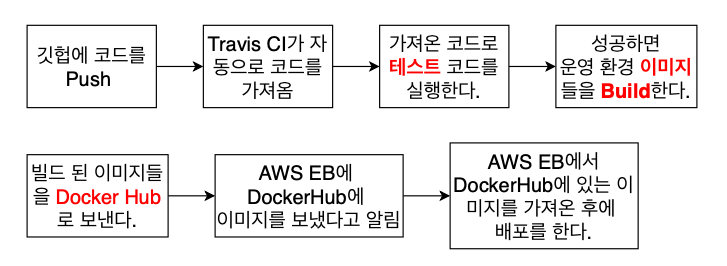
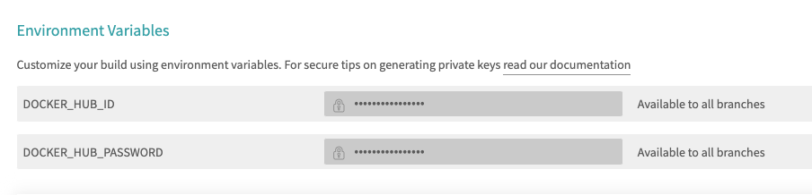

# 9. 복잡한 어플을 실제로 배포해보기(테스트 & 배포 부분)

## 섹션 설명

8강에서 작성한 소스코드가 에러가 없는지 테스트를 한 후 테스트에서 성공을 하면 AWS를 통해서 배포하는 것까지 해보겠습니다.


## 도커 환경의 MYSQL 부분 정리하기

Mysql이 이제 도커 안에서 돌아가는 것이 아닌 AWS에서 돌아가고 있으므로 이에 따른 수정이 필요합니다.

우선 docker-compose.yml에서 mysql 부분을 지워줍니다.

``` yml
  # mysql:
  #   build: ./mysql
  #   restart: unless-stopped
  #   container_name: app_mysql
  #   ports:
  #     - "3306:3306"
  #   volumes:
  #     - ./mysql/mysql_data:/var/lib/mysql
  #     - ./mysql/sqls/:/docker-entrypoint-initdb.d/
  #   environment:
  #     MYSQL_ROOT_PASSWORD: 1234
  #     MYSQL_DATABASE: myapp
```


그 후 backend/db.js를 AWS의 정보에 맞게 수정해줍니다.

이 부분은 AWS RDS를 생성 후 이어서 해줍니다.


## Github에 소스코드 올리기

github repo 생성 후 push 해줍니다.

이 때 backend/.gitignore를 만들어줍니다.

```
node_modules
```


마찬가지로 mysql/.gitignore를 만들어줍니다.

```
mysql_data
```


## Travis CI Steps




Docker Hub에 빌드된 이미지를 보내고 AWS에서 그 이미지를 가져가므로 EB안에서 다시 이미지를 빌드하지 않아도 됩니다.

즉, 모든 과정에서 빌드가 한 번만 이루어집니다.


https://app.travis-ci.com/

위에 접속해서 github으로 로그인합니다.


## .travis.yml 파일 작성하기


travis-ci에서 id와 password를 환경변수로 등록해줍니다.




frontend/src/App.test.js에 테스트가 깨질테니 테스트를 지워줍시다.


## Dockerrun.aws.json에 대해서

## Dockerrun.aws.json 파일 작성하기

## 다중 컨테이너 앱을 위한 Elastic beanstalk 환경 생성

## VPC(virtual private cloud)와 Security Group 설정하기

## MYSQL을 위한 AWS RDS 생성하기

## Security Group 생성하기

## Security Group 적용하기

## EB와 RDS 소통을 위한 환경 변수 설정하기

## travis.yml 파일 작성하기 (배포 부분)

## Travis CI의 AWS 접근을 위한 API key 생성
